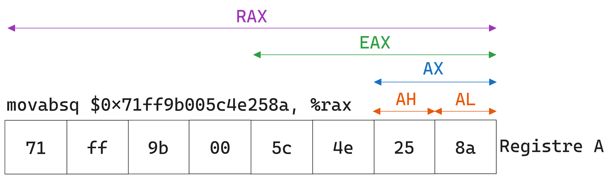
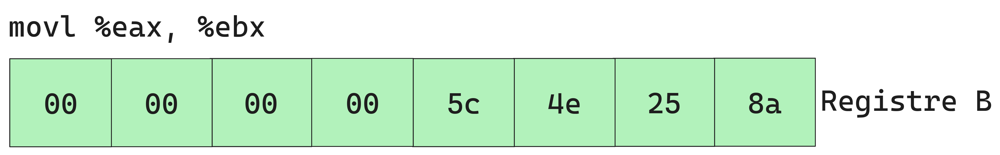
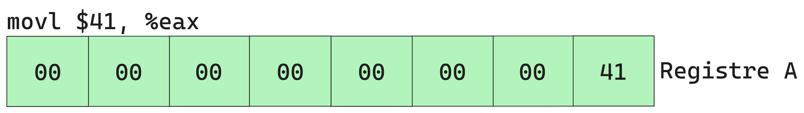
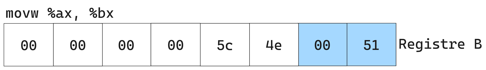
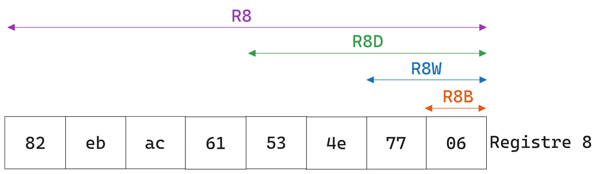
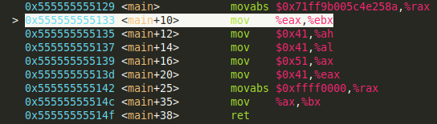
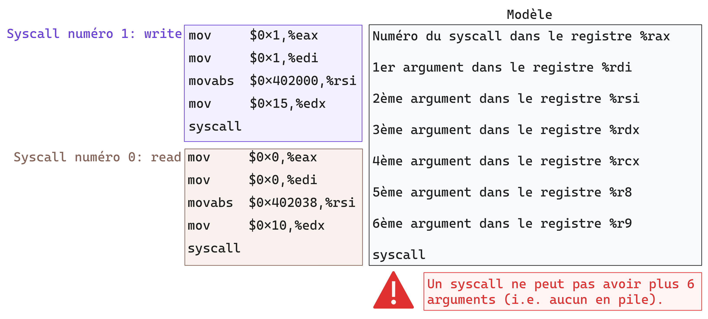

# ASMx86_64


## Notes importantes

> `movabs` est un `mov` qui ne peut utiliser que des immédiats et des registers (pas d'adresse mémoire), par contre il peut utiliser des immédiats de 64 bits.

### Rex prefix
based on :
- https://wiki.osdev.org/X86-64_Instruction_Encoding


## Registres en x86_64

based on:
- https://wiki.osdev.org/CPU_Registers_x86-64
- https://stackoverflow.com/questions/26280229/is-x87-fp-stack-still-relevant
- Il exsite plusieurs types de registres dans l'architecture x86_64:
  - **General Purpose Registers**
  - **The pointer register**
  - *Control Registers*
  - Debug Registers
  - Model-Specific Register
  - XMM Registers
  - Float registers (en pratique XMM registers les ont remplacés)
- On va principalement parler des deux premieres familles de registres.

### General Purpose Registers

- En x86_64 les registres généralistes ont une taille maximale de 64-bits (8 octets). Il existe 16 registres dans cette famille, dont certain ont une utilisation spécifique.
- Les registres sont : 
  - **rax**, **rbx**, **rcx**, **rdx**: version 64-bits des registres: A, B, C, D.
  - **rbp**, **rsp**: version 64-bits des registres de gestion de la pile: BP(base pointer) et SP (stack pointer).
  - **rsi**, **rdi**: version 64-bits des registres pour la copie  de données: SI(source index) et DI(destination index).
  - **r8**,**r9**,**r10**,**r11**,**r12**,**r13**,**r14**,**r15**: registres 64-bits introduit avec l'architecture x86_64 (inexistant en architecture x86 (32-bits)).

- Les registres hérités de l'architecture x86 **(A,B,C,D)** peuvent être accédés de différentes maniéres, on peut faire en sorte d'accéder que certains octets des registres. 

- Comme le montre dans les figures et code suivants, chaque nom permet de spécifier les octets à lire ou à écrire (sachez qu'il y existe une difference de comportement pour les versions 32-bits et 64-bits):

```asm
//source:
.global main

main:
    movabsq $0x71ff9b005c4e258a, %rax
    movl %eax, %ebx
    movb $0x41, %ah
    movb $0x41, %al
    movw $0x51, %ax
    movl $0x41, %eax
    movq $0x51, %rax
    movw %ax, %bx
    ret

// compilé:
main:
    1129:	48 b8 8a 25 4e 5c 00 	movabs $0x71ff9b005c4e258a,%rax
    1130:	9b ff 71 
    1133:	89 c3                	mov    %eax,%ebx
    1135:	b4 41                	mov    $0x41,%ah
    1137:	b0 41                	mov    $0x41,%al
    1139:	66 b8 51 00          	mov    $0x51,%ax
    113d:	b8 41 00 00 00       	mov    $0x41,%eax
    1142:	48 c7 c0 51 00 00 00 	mov    $0x51,%rax
    1149:	66 89 c3             	mov    %ax,%bx
    114c:	c3                   	ret   
```

<center><figure>
	
	<figcaption>Charger le registre <strong>%rax</strong> avec une valeur immédiate de 64-bits.</figcaption>
</figure></center>

<center><figure>
	
	<figcaption>Charger que les 32-bits de poids faibles de <strong>%rax</strong> dans <strong>%rbx</strong> qui remplira le reste avec des <em>zéros</em>.</figcaption>
</figure></center>

<center><figure>
	
	<figcaption>Modifier que le deuxième octet de <strong>%rax</strong>.</figcaption>
</figure></center>

<center><figure>
	
	<figcaption>Modifier que le premier octet de <strong>%rax</strong>.</figcaption>
</figure></center>

<center><figure>
	
	<figcaption>Modifier que les deux premiers octets (16-bits) de <strong>%rax</strong>.</figcaption>
</figure></center>


<center><figure>
	
	<figcaption>Modifier les quatre premiers octets (32-bits) de <strong>%rax</strong> tout en rajoutant des zéros jusqu'au 64ème bit.</figcaption>
</figure></center>


<center><figure>
	
	<figcaption>Modifier tout les huit octets (64-bits) de <strong>%rax</strong> en rajoutant des zéros s'il le faut.</figcaption>
</figure></center>


<center><figure>
	
	<figcaption>Charge les deux premiers octets de <strong>%rax</strong> dans <strong>%rbx</strong>.</figcaption>
</figure></center>

- Pour les autres registres hérités **(SI,DI,SP,BP)** ne permettent pas d'accéder leur deuxième octet. 

<center><figure>
	
	<figcaption>Les différentes maniéres d'accéder au registre <strong>%rsp</strong>.</figcaption>
</figure></center>

- Pour les nouveaux registres de l'architecture x86_64 **(r8,r9,r10,r11,r12,r13,r14,r15)** on utilise plutot des suffix pour spécifier la taille à lire ou à écrire.

<figure>
<center>
	
	<figcaption>Registre 8 de l'architecture x86_64.</figcaption>
</center>
</figure>

> - On remarque que les deux instructions `movl $0x41, %eax` et `movq $0x51, %rax` se comportent exactement de la même maniére dans ce cas de figure, tout en ayant des tailles différentes: la version avec `%eax` utilisant 2 octets de moins.
> - Pour des raisons de performances de calculs en 32-bits (comme expliqué [ici](https://stackoverflow.com/questions/11177137/why-do-x86-64-instructions-on-32-bit-registers-zero-the-upper-part-of-the-full-6)) amd a fait en sorte de forcer les 32-bits de poids fort à zéro.
> - **Retenez juste que les instructions 32-bits forcent les 32-bits de poids fort à zéro.**

### Pointer Register (RIP)

- Le pointer register contient l'**adresse** mémoire ou la prochaine instruction à exécuter est située. Comme vous pouvez le voir dans les captures suivantes, quand le CPU fini d'exécuter l'instruction `movabs` qui est à l'adresse `0x5129` la valeur de **rip** est l'adresse de l'instruction suivante `mov %eax, %ebx` à l'adresse `0x5133`.

<center><figure>
	
  
	<figcaption>La valeur du <strong>%rip</strong> est calculée lors de l'exécution d'une instruction.</figcaption>
</figure></center>

- Il faut que vous sachiez que les instructions ont des tailles différentes. elles varient de `1 octets` jusqu'à `15 octets`. Vu qu'en mémoire les données sont stockés par octects, durant la lecture d'un octet de l'instruction le CPU sait s'il doit interpreter les prochains octets comme faisant parti de cette même instruction grâce aux octects qu'il a déja décodé.

- Les instructions d'appel et de branchement `jmp, call, ret, ...` ne font que modifier la valeur de ce fameux registre **%rip**, en d'autre termes elles changent l'adresse de la prochaine instruction.

### Résumé sur les registres
Based on:
- https://wiki.osdev.org/Calling_Conventions
- https://math.hws.edu/eck/cs220/f22/registers.html
<table class="colorful-theme" align="center" cellpadding="7px" cellspacing="0" border="2">
<tbody><tr>
   <th>64-bit</th>
   <th>32-bit</th>
   <th>16-bit</th>
   <th>8-bit</th>
   <th>Utilisation dans l'ABI Linux AMD64</th>
   <th>Appel de fonction</th>
</tr>
<tr>
   <td>rax</td><td>eax</td><td>ax</td><td>ah,al</td>
      <td>Valeur de retour</td>
      <td>Peut être modifier par la fonction appelée</td>
</tr>   
<tr>
   <td>rbx</td><td>ebx</td><td>bx</td><td>bh,bl</td>
      <td>&nbsp;</td>
      <td>Doit être sauvegardé par la fonction appelée</td>
      
</tr>   
<tr>
   <td>rcx</td><td>ecx</td><td>cx</td><td>ch,cl</td>
      <td>4<sup>th</sup> argument entier</td>
      <td>Peut être modifier par la fonction appelée</td>
      
</tr>   
<tr>
   <td>rdx</td><td>edx</td><td>dx</td><td>dh,dl</td>
      <td>3<sup>rd</sup> argument entier</td>
      <td>Peut être modifier par la fonction appelée</td>
      
</tr>   
<tr>
   <td>rsi</td><td>esi</td><td>si</td><td>sil</td>
      <td>2<sup>e</sup> argument entier</td>
      <td>Peut être modifier par la fonction appelée</td>
      
</tr>   
<tr>
   <td>rdi</td><td>edi</td><td>di</td><td>sil</td>
      <td>1<sup>er</sup>argument entier</td>
      <td>Peut être modifier par la fonction appelée</td>
      
</tr>   
<tr>
   <td>rbp</td><td>ebp</td><td>bp</td><td>bpl</td>
      <td>Début d'une stack frame</td>
      <td>Bien faire attention à son utilisation et à sa sauvegarde</td>
</tr>   
<tr>
   <td>rsp</td><td>esp</td><td>sp</td><td>spl</td>
      <td>La fin de la pile (top of stack)</td>
      <td>Extrêmement faire attention à son utilisation et à sa sauvegarde</td>
</tr>
<tr>
   <td>r8</td><td>r8d</td><td>r8w</td><td>r8b</td>
      <td>5<sup>e</sup> argument entier</td>
      <td>Peut être modifier par la fonction appelée</td>
      
</tr>
<tr>
   <td>r9</td><td>r9d</td><td>r9w</td><td>r9b</td>
      <td>6<sup>e</sup> argument entier</td>
      <td>Peut être modifier par la fonction appelée</td>
      
</tr>
<tr>
   <td>r10</td><td>r10d</td><td>r10w</td><td>r10b</td>
      <td>&nbsp;</td>
      <td>Peut être modifier par la fonction appelée</td>
      
</tr>
<tr>
   <td>r11</td><td>r11d</td><td>r11w</td><td>r11b</td>
      <td>&nbsp;</td>
      <td>Peut être modifier par la fonction appelée</td>
      
</tr>
<tr>
   <td>r12</td><td>r12d</td><td>r12w</td><td>r12b</td>
      <td>&nbsp;</td>
      <td>Doit être sauvegardé par la fonction appelée</td>
      
</tr>
<tr>
   <td>r13</td><td>r13d</td><td>r13w</td><td>r13b</td>
      <td>&nbsp;</td>
      <td>Doit être sauvegardé par la fonction appelée</td>
      
</tr>
<tr>
   <td>r14</td><td>r14d</td><td>r14w</td><td>r14b</td>
      <td>&nbsp;</td>
      <td>Doit être sauvegardé par la fonction appelée</td>
      
</tr>
<tr>
   <td>r15</td><td>r15d</td><td>r15w</td><td>r15b</td>
      <td>&nbsp;</td>
      <td>Doit être sauvegardé par la fonction appelée</td>
      
</tr>
</tbody></table>

## Les flags en x86_64

- Les instructions `mov` ne modifie pas les flags.
- L'instruction test est ... , permet de ...
- L'instruction cmp est tout simplement une soustraction sans sauvegarde du résultat. Elle permet de ...


## Stack frame

> parler d'enter et de leave

## L'ordre d'exécution

> Les accès mémoire sont fait de façon asynchrone -> registres doit être independant.
> https://www.wikiwand.com/en/Register_renaming

## Syscalls en assembleur
(based on page 124 of the linux amd64 ABI : https://refspecs.linuxbase.org/elf/x86_64-abi-0.99.pdf)
- Dans les instructions du programme **safe** vous avez découvert l'instruction `syscall`. Si vous lisez la description de l'instruction dans le manuel d'intel, vous trouverez la phrase *"Fast call to privilege level 0 system procedures."*. Ils la décrivent comment étant rapide, cela est en rapport à l'ancienne impementation ou le syscall était une interruption lambda et le CPU devait vérifier le type de l'interruption à chaque fois.
- Sinon pour faire court, c'est l'instruction assembleur utilisée pour faire appel à un syscall défini par l'OS qui va s'exécuter en mode Kernel (d'ou le privilege level 0).
- Vous remarquerez que plusieurs registres sont initialisés avant d'instruction syscall.
<figure>

<center>
<caption>Illustration expliquant l'appel à un syscall</caption>
</center>
</figure>

- Le syscall retrounera sa valeur dans %rax comme le font toutes les autres fonctions. Avec les valeurs dans l'interval **[-4095,-1]** représente un code d'erreur de type errno.

- Pour voir les différents syscalls disponible sur le kernel linux pour l'architecture x86-64, regardez [cette page github](https://github.com/torvalds/linux/blob/master/arch/x86/entry/syscalls/syscall_64.tbl). Et pour avoir une idée sur les arguments de chaque syscall il existe [cette page de blog](https://blog.rchapman.org/posts/Linux_System_Call_Table_for_x86_64/) très bien écrite, mais malheuresement elle n'est plus à jour.
