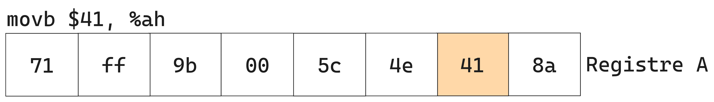

<!-- regex for links: [-a-zA-Z0-9@:%._\+~#= "/<>]+ -->

- [1. Les bases](#1-les-bases)
  - [1.1. Notes importantes](#11-notes-importantes)
  - [1.2. Registres en x86\_64](#12-registres-en-x86_64)
    - [1.2.1. General Purpose Registers](#121-general-purpose-registers)
    - [1.2.2. Pointer Register (RIP)](#122-pointer-register-rip)
    - [1.2.3. Résumé sur les registres](#123-résumé-sur-les-registres)
  - [1.3. Les flags en x86\_64](#13-les-flags-en-x86_64)
  - [1.4. Stack frame](#14-stack-frame)
  - [1.5. Appeler les fonctions de la libc](#15-appeler-les-fonctions-de-la-libc)
    - [1.5.1. Fonction simple](#151-fonction-simple)
    - [1.5.2. Fonction variadic (nombre d'arguments dynamique)](#152-fonction-variadic-nombre-darguments-dynamique)
  - [1.6. Syscalls en assembleur](#16-syscalls-en-assembleur)
- [2. Svartalfheim](#2-svartalfheim)
  - [2.1. Rex prefix](#21-rex-prefix)
  - [2.2. L'ordre d'exécution](#22-lordre-dexécution)

____

# 1. Les bases

## 1.1. Notes importantes

> `movabs` est un `mov` qui ne peut utiliser que des immédiats et des registers (pas d'adresse mémoire), par contre il peut utiliser des immédiats de 64 bits.


## 1.2. Registres en x86_64

- Il existe plusieurs types de registres dans l'architecture x86_64:
  - **General Purpose Registers**
  - **The pointer register**
  - **Flag Register**
  - *Control Registers*
  - Debug Registers
  - Model-Specific Register
  - XMM Registers
  - Float registers (en pratique XMM registers les ont remplacés)
- On va principalement parler des deux premieres familles de registres.

### 1.2.1. General Purpose Registers

- En x86_64 les registres généralistes ont une taille maximale de 64-bits (8 octets). Il existe 16 registres dans cette famille, dont certain ont une utilisation spécifique.
- Les registres sont : 
  - **rax**, **rbx**, **rcx**, **rdx**: version 64-bits des registres: A, B, C, D.
  - **rbp**, **rsp**: version 64-bits des registres de gestion de la pile: BP(base pointer) et SP (stack pointer).
  - **rsi**, **rdi**: version 64-bits des registres pour la copie  de données: SI(source index) et DI(destination index).
  - **r8**,**r9**,**r10**,**r11**,**r12**,**r13**,**r14**,**r15**: registres 64-bits introduit avec l'architecture x86_64 (inexistant en architecture x86 (32-bits)).

- Les registres hérités de l'architecture x86 **(A,B,C,D)** peuvent être accédés de différentes manières, on peut faire en sorte d'accéder que certains octets des registres. 

- Comme le montrent les figures et code suivants, chaque nom permet de spécifier les octets à lire ou à écrire (sachez qu'il y existe une différence de comportement pour les versions 32-bits et 64-bits, même si à premiere vue elles paraissent equivalentes):

```nasm
; source:
.global main

main:
    movabsq $0x71ff9b005c4e258a, %rax
    movl %eax, %ebx
    movb $0x41, %ah
    movb $0x41, %al
    movw $0x51, %ax
    movl $0x41, %eax
    movq $0x51, %rax
    movw %ax, %bx
    ret

; compilé:
main:
    1129:	48 b8 8a 25 4e 5c 00 	movabs $0x71ff9b005c4e258a,%rax
    1130:	9b ff 71 
    1133:	89 c3                	mov    %eax,%ebx
    1135:	b4 41                	mov    $0x41,%ah
    1137:	b0 41                	mov    $0x41,%al
    1139:	66 b8 51 00          	mov    $0x51,%ax
    113d:	b8 41 00 00 00       	mov    $0x41,%eax
    1142:	48 c7 c0 51 00 00 00 	mov    $0x51,%rax
    1149:	66 89 c3             	mov    %ax,%bx
    114c:	c3                   	ret   
```

<center><div  class="figure-container"><figure>
	
	<figcaption>Charger le registre <strong>%rax</strong> avec une valeur immédiate de 64-bits.</figcaption>
</figure></div></center>

<center><div  class="figure-container"><figure>
	
	<figcaption>Charger que les 32-bits de poids faibles de <strong>%rax</strong> dans <strong>%rbx</strong> qui remplira le reste avec des <em>zéros</em>.</figcaption>
</figure></div></center>

<center><div  class="figure-container"><figure>
	
	<figcaption>Modifier que le deuxième octet de <strong>%rax</strong>.</figcaption>
</figure></div></center>

<center><div  class="figure-container"><figure>
	
	<figcaption>Modifier que le premier octet de <strong>%rax</strong>.</figcaption>
</figure></div></center>

<center><div  class="figure-container"><figure>
	
	<figcaption>Modifier que les deux premiers octets (16-bits) de <strong>%rax</strong>.</figcaption>
</figure></div></center>


<center><div  class="figure-container"><figure>
	
	<figcaption>Modifier les quatre premiers octets (32-bits) de <strong>%rax</strong> tout en rajoutant des **zéros** jusqu'au 64ème bit.</figcaption>
</figure></div></center>


<center><div  class="figure-container"><figure>
	
	<figcaption>Modifier tous les huit octets (64-bits) de <strong>%rax</strong> en rajoutant des zéros s'il le faut.</figcaption>
</figure></div></center>


<center><div  class="figure-container"><figure>
	
	<figcaption>Charger les deux premiers octets de <strong>%rax</strong> dans <strong>%rbx</strong>.</figcaption>
</figure></div></center>

- Les autres registres hérités **(SI,DI,SP,BP)** ne permettent pas d'accéder leur deuxième octet. 

<center><div  class="figure-container"><figure>
	
	<figcaption>Les différentes manières d'accéder au registre <strong>%rsp</strong>.</figcaption>
</figure></div></center>

- Pour les nouveaux registres de l'architecture x86_64 **(r8,r9,r10,r11,r12,r13,r14,r15)** on utilise plutôt des suffixes pour spécifier la taille à lire ou à écrire.


<center><div  class="figure-container">
<figure>
	
	<figcaption>Registre 8 de l'architecture x86_64.</figcaption>
</figure>
</div></center>

> - On remarque que les deux instructions `movl $0x41, %eax` et `movq $0x51, %rax` se comportent exactement de la même maniére dans ce cas de figure, tout en ayant des tailles différentes: la version avec `%eax` utilisant 2 octets de moins.
> - Pour des raisons de performances de calculs en 32-bits (comme expliqué <a href="https://stackoverflow.com/questions/11177137/why-do-x86-64-instructions-on-32-bit-registers-zero-the-upper-part-of-the-full-6" target="_blank">ici</a>) amd a fait en sorte de forcer les 32-bits de poids fort à zéro.
> - **Retenez juste que les instructions 32-bits forcent les 32-bits de poids fort à zéro.**

<blockquote class="small-text">
Références:
<ul>
<li><a href="https://wiki.osdev.org/CPU_Registers_x86-64">https://wiki.osdev.org/CPU_Registers_x86-64</a></li>
<li><a href="https://stackoverflow.com/questions/26280229/is-x87-fp-stack-still-relevant">https://stackoverflow.com/questions/26280229/is-x87-fp-stack-still-relevant</a></li>
</ul>
</blockquote>

### 1.2.2. Pointer Register (RIP)

- Le pointer register contient l'**adresse** mémoire ou la prochaine instruction à exécuter est située. Comme vous pouvez le voir dans les captures suivantes, quand le CPU fini d'exécuter l'instruction <a href="https://sourceware.org/binutils/docs/as/i386_002dVariations.html" target="_blank"><code class=" clickable">movabs</code></a> qui est à l'adresse `0x5129` la valeur de `%rip` est l'adresse de l'instruction suivante `mov %eax, %ebx` à l'adresse `0x5133`.

<center><div  class="figure-container"><figure>
	
  
	<figcaption>La valeur du <strong>%rip</strong> est calculée lors de l'exécution d'une instruction.</figcaption>
</figure></div></center>

- Il faut que vous sachiez que les instructions ont des tailles différentes. elles varient de `1 octets` jusqu'à `15 octets`. Vu qu'en mémoire les données sont stockés par octets, durant la lecture d'un octet de l'instruction le CPU sait s'il doit interpréter les prochains octets comme faisant partie de cette même instruction grâce aux octets qu'il a déja décodés.

- Les instructions d'appel et de branchement `jmp`, `call`, `ret`, ... ne font que modifier la valeur de ce fameux registre `%rip`, en d'autres termes elles changent l'adresse de la prochaine instruction.

### 1.2.3. Résumé sur les registres

<center class="table-wrapper"><table align="center" cellpadding="7px" cellspacing="0" border="2">
<tbody><tr class="header-row">
   <th>64-bits</th>
   <th>32-bits</th>
   <th>16-bits</th>
   <th>8-bits</th>
   <th>Utilisation dans l'ABI Linux AMD64</th>
   <th>Appel de fonction</th>
</tr>
<tr class="green-row">
   <td>rax</td><td>eax</td><td>ax</td><td>ah,al</td>
      <td>Valeur de retour</td>
      <td>Peut être modifié par la fonction appelée</td>
</tr>   
<tr class="red-row">
   <td>rbx</td><td>ebx</td><td>bx</td><td>bh,bl</td>
      <td>&nbsp;</td>
      <td>Doit être sauvegardé par la fonction appelée</td>
      
</tr>   
<tr class="green-row">
   <td>rcx</td><td>ecx</td><td>cx</td><td>ch,cl</td>
      <td>4<sup>th</sup> argument entier</td>
      <td>Peut être modifié par la fonction appelée</td>
      
</tr>   
<tr class="green-row">
   <td>rdx</td><td>edx</td><td>dx</td><td>dh,dl</td>
      <td>3<sup>rd</sup> argument entier</td>
      <td>Peut être modifié par la fonction appelée</td>
      
</tr>   
<tr class="green-row">
   <td>rsi</td><td>esi</td><td>si</td><td>sil</td>
      <td>2<sup>e</sup> argument entier</td>
      <td>Peut être modifié par la fonction appelée</td>
      
</tr>   
<tr class="green-row">
   <td>rdi</td><td>edi</td><td>di</td><td>dil</td>
      <td>1<sup>er</sup>argument entier</td>
      <td>Peut être modifié par la fonction appelée</td>
      
</tr>   
<tr class="red-row">
   <td>rbp</td><td>ebp</td><td>bp</td><td>bpl</td>
      <td>Début d'une stack frame</td>
      <td>Bien faire attention à son utilisation et à sa sauvegarde</td>
</tr>   
<tr class="red-row">
   <td>rsp</td><td>esp</td><td>sp</td><td>spl</td>
      <td>La fin de la pile (top of stack)</td>
      <td>Extrêmement faire attention à son utilisation et à sa sauvegarde</td>
</tr>
<tr class="green-row">
   <td>r8</td><td>r8d</td><td>r8w</td><td>r8b</td>
      <td>5<sup>e</sup> argument entier</td>
      <td>Peut être modifié par la fonction appelée</td>
      
</tr>
<tr class="green-row">
   <td>r9</td><td>r9d</td><td>r9w</td><td>r9b</td>
      <td>6<sup>e</sup> argument entier</td>
      <td>Peut être modifié par la fonction appelée</td>
      
</tr>
<tr class="green-row">
   <td>r10</td><td>r10d</td><td>r10w</td><td>r10b</td>
      <td>&nbsp;</td>
      <td>Peut être modifié par la fonction appelée</td>
      
</tr>
<tr class="green-row">
   <td>r11</td><td>r11d</td><td>r11w</td><td>r11b</td>
      <td>&nbsp;</td>
      <td>Peut être modifié par la fonction appelée</td>
      
</tr>
<tr class="red-row">
   <td>r12</td><td>r12d</td><td>r12w</td><td>r12b</td>
      <td>&nbsp;</td>
      <td>Doit être sauvegardé par la fonction appelée</td>
      
</tr>
<tr class="red-row">
   <td>r13</td><td>r13d</td><td>r13w</td><td>r13b</td>
      <td>&nbsp;</td>
      <td>Doit être sauvegardé par la fonction appelée</td>
      
</tr>
<tr class="red-row">
   <td>r14</td><td>r14d</td><td>r14w</td><td>r14b</td>
      <td>&nbsp;</td>
      <td>Doit être sauvegardé par la fonction appelée</td>
      
</tr>
<tr class="red-row">
   <td>r15</td><td>r15d</td><td>r15w</td><td>r15b</td>
      <td>&nbsp;</td>
      <td>Doit être sauvegardé par la fonction appelée</td>
      
</tr>
</tbody></table></center>


:pencil: **Remarques:**
- Quand vous appelez une fonction il **ne faut pas** vous attendre à ce que les registres en **vert** aient gardé leur valeur. Autrement dit, si votre programme assembleur utilise le registre `%rdx` il faut qu'il soit sauvegardé (`pushq %rdx`) avant l'appel `call my_func` et puis restauré après l'appel (`popq %rdx`).
- Par contre si une fonction veut utiliser un des registres en **rouge**, elle doit le sauvegarder avant sa modification et le restaurer avant le retour (`ret`).

```nasm
my_func:
   pushq %rbx ; sauvegarde %rbx
   pushq %r14 ; sauvegarde %r14
   ; ...
   movq %rdi, %rbx ; modifie %rbx
   ; ...
   movq (%rbx), %r14 ; modifie %r14
   ; ...
   addq %r14, %edx ; modifie %rax
   ; ...
   popq %r14 ; restaure %r14
   popq %rbx ; restaure %rbx
   ret

main:
   ; ...
   movabs $4523902, %rbx
   movl $125, %edx ; utilise %eax
   movl $45, %edi
   pushl %edx
   call my_func
   ; %edx a été changé par my_func
   movl %edx, (%rbx) ; la valeur de %rbx est maintenue par my_func
   ; maintenant, j'ai besoin de mon %edx
   popl %edx
   movl %edx, 4(%rbx) ; la valeur initiale de %edx est écrite en adresse mémoire %rbx + 4
   ; ...
   ret
   
```

<blockquote class="small-text">
Références:
<ul>
<li><a href="https://wiki.osdev.org/Calling_Conventions" target="_blank">https://wiki.osdev.org/Calling_Conventions</a></li>
<li><a href="https://math.hws.edu/eck/cs220/f22/registers.html" target="_blank">https://math.hws.edu/eck/cs220/f22/registers.html</a></li>
</ul>
</blockquote>

## 1.3. Les flags en x86_64

- Lors de l'exécution de certaines instructions, il est intéressant de garder certaines informations sur le résultat de ces dernières, pour ainsi pouvoir rendre certaines instructions inter-dépendantes. Par exemple, si on veut additionner des nombres de taille supérieure à 64-bits, disons 128-bits il est primordiale de savoir si l'addition des 64-bits de poids faible a générée une retenue pour le 65-bits ou pas pour avoir un résultat correct (<a href="https://www.felixcloutier.com/x86/adc" target="_blank"><code class=" clickable">adc</code></a>). Il existe plein d'autres cas autre que les jump, où l'on veut avoir des informations sur le résultat de l'instruction précédente.
- En x86_64, on a à notre disposition le registre **RFLAGS** pour stocker et accéder aux informations décrivant la nature du résultat d'une instruction. En x86(32 bits), le registre se dénommait **EFLAGS** et à l'âge de l'architecture 16-bits **FLAGS**. Vous pouvez voir comment ce registre fut étendue avec le changements d'architecture dans la figure ci-dessous.
  - En pratique, le registre RFLAGS décrit aussi les restrictions appliquées actuellement, ainsi une instruction va changer son comportement, voir lever une exception dépendant des restrictions actives.

<center><div  class="figure-container"><figure>
	
	<figcaption>Registres RFLAGS avec tous les FLAGS connus.</figcaption>
</figure></div></center>

- Lors du développement de l'architecture, les ingénieurs ont dû choisir quelles informations garder sur le résultat d'une instruction. Pour optimiser un maximum tout en gardant l'utilisation simple, ils se sont limiter à un seul registre, où chaque **bit** annonce la présence ou l'absence d'un flag décrivant un état. Les bits vides sont réservés et intel ou amd les utilisent comme ils veulent.

- Les flags sont divisés en **3** groupes:
  - <span style="color: rgba(233, 163, 91,255);">Status Flags:</span> 
    - **CF**(Carry Flag): **1** s'il y a eu une retenue au-delà du bit de poids fort du résultat, sinon **0**.
    - **PF**(Parity Flag): **1** si le nombre de bits à 1 dans les 8-bits de poids faible est pair, **0** si impair.
    - **AF**(Auxiliary Carry Flag): **1** s'il y a eu une retenue depuis le bit 3 vers le bit 4, sinon **0**.
    - **ZF**(Zero Flag): **1** si le résultat est nul, sinon **0**.
    - **SF**(Sign Flag): **1** si le résultat est négatif, sinon **0**.
    - **OF**(Overflow Flag): **1** si le résultat en signé a débordé (changement de signe inattendu) au-delà de la taille du registre destination, sinon **0**.
  - <span style="color: #7dad4e;">Control Flags:</span>
    - **IF**(Interrupt Flag): **1** si les interruptions sont actives, **0** si désactivées.
    - **DF**(Direction Flag): **1** pour que les adresses soient décrementées lors des instructions iteratives (<a href="https://www.felixcloutier.com/x86/rep:repe:repz:repne:repnz" target="_blank"><code class=" clickable">rep</code></a>), **0** pour incrémenter les adresses.
    - **TF**(Trap Flag): **1**  pour appeler une fonction après chaque instruction permettant d'avoir une exécution pas à pas (debug), **0** pour une exécution classique.
    - **MD**(Mode Flag).
  - <span style="color: #559393;">System Flags:</span>
    - **IOPL**(I/O privilege level).
    - ...

- La mise à jour des flags nécessite des tests et des écritures, cela prend du temps, pour ne pas en perdre inutilement, ils ont fait en sorte que certaines instructions ne touchent pas aux flags (le `mov` par exemple), et même que les instructions mettant à jour les flags, ne touchent pas à tous les flags, seulement ceux nécessaires, entre autres l'instruction `add` ne met à jour que les **status flags**.
   - En général, on dit que les instructions qui ne font **que** **déplacer** des données ne modifient pas les flags. Par contre, celles qui **effectuent** des **calculs** mettent à jour les flags nécessaires.
   - Il existe certaines exceptions d'instructions qui calculent mais ne mettent pas à jour les flags, parmi elles : <a href="https://www.felixcloutier.com/x86/not" target="_blank"><code class=" clickable">not</code></a> et <a href="https://www.felixcloutier.com/x86/lea" target="_blank"><code class=" clickable">lea</code></a>.

- Il est possible d'accéder au registre **RFLAGS** via des instructions spéciales : 
  - <a href="https://www.felixcloutier.com/x86/lahf" target="_blank"><code class=" clickable">lahf</code></a> enregistre les 8-bits de poids faibles de **FLAGS** dans **ah**. <a href="https://www.felixcloutier.com/x86/sahf" target="_blank"><code class=" clickable">sahf</code></a> récupère les valeurs de **SF**, **ZF**, **AF**, **PF**, et **CF** (les 8-bits de poids faible) depuis **ah**.
  - <a href="https://www.felixcloutier.com/x86/clc" target="_blank"><code class=" clickable">clc</code></a> (mettre CF à 0), <a href="https://www.felixcloutier.com/x86/stc" target="_blank"><code class=" clickable">stc</code></a> (mettre CF à 1), <a href="https://www.felixcloutier.com/x86/cmc" target="_blank"><code class=" clickable">cmc</code></a> (inverser CF), <a href="https://www.felixcloutier.com/x86/cli" target="_blank"><code class=" clickable">cli</code></a> (mettre IF à 0), <a href="https://www.felixcloutier.com/x86/sti" target="_blank"><code class=" clickable">sti</code></a> (mettre IF à 1), <a href="https://www.felixcloutier.com/x86/cld" target="_blank"><code class=" clickable">cld</code></a> (mettre DF à 0), <a href="https://www.felixcloutier.com/x86/std" target="_blank"><code class=" clickable">std</code></a> (mettre DF à 1).
  - <a href="https://www.felixcloutier.com/x86/pushf:pushfd:pushfq" target="_blank"><code class=" clickable">pushf</code></a>/<a href="https://www.felixcloutier.com/x86/popf:popfd:popfq" target="_blank"><code class=" clickable">popf</code></a> empile/dépile le registre **FLAGS**, `pushfd`/`popfd` empile/dépile le registre **EFLAGS**, `pushfq`/`popfq` empile/dépile le registre **RFLAGS**.
    - Les instructions ont le même opcode, tout dépend du mode dans lequel le CPU est.

- L'instruction `cmp i1, i2` fait une soustraction `i2 - i1` sans sauvegarder le résultat dans l'opérant destination et met à jour les flags **CF**, **OF**, **SF**, **ZF**, **AF**, et **PF**.
- L'instruction `test i1, i2` fait un bit-wise AND `i2 & i1` et met à jour les flags **PF**, **SF**, **ZF**. Elle permet de tester si un registre est nul `testq %rax, %rax`, elle est plus compacte que `cmp $0, %rax`.
- Les instructions de la famille <a href="https://www.felixcloutier.com/x86/jcc" target="_blank"><code class=" clickable">jcc</code></a> vérifient les flags pour charger l'adresse spécifiée dans le registre **RIP** ou pas (**RIP** pointe vers l'instruction suivante).

<blockquote class="small-text">
Références:
<ul>
<li><a href="https://fr.wikibooks.org/wiki/Programmation_Assembleur/x86/Les_flags" target="_blank">https://fr.wikibooks.org/wiki/Programmation_Assembleur/x86/Les_flags</a></li>
<li><a href="https://www.wikiwand.com/en/FLAGS_register" target="_blank">https://www.wikiwand.com/en/FLAGS_register</a></li>
</ul>
</blockquote>

<!-- http://ref.x86asm.net/coder64.html -->

## 1.4. Stack frame

> parler d'enter et de leave
> https://stackoverflow.com/questions/72649142/difference-between-amd64-and-intel-x86-64-stack-frame
> https://stackoverflow.com/questions/26323215/do-any-languages-compilers-utilize-the-x86-enter-instruction-with-a-nonzero-ne
> https://stackoverflow.com/questions/5959890/enter-vs-push-ebp-mov-ebp-esp-sub-esp-imm-and-leave-vs-mov-esp-ebp

## 1.5. Appeler les fonctions de la libc

### 1.5.1. Fonction simple

### 1.5.2. Fonction variadic (nombre d'arguments dynamique)
> printf
> since variadics takes any type of arguments, it is hard to know how much registers to save when using it, saving XMM registers is too expensive to do it each time, thus %al is used to store the number of vector registers

## 1.6. Syscalls en assembleur
- Dans les instructions du programme **safe** vous avez découvert l'instruction <a href="https://www.felixcloutier.com/x86/syscall" target="_blank"><code class=" clickable">syscall</code></a>. Si vous lisez la description de l'instruction dans le manuel d'intel, vous trouverez la phrase *"Fast call to privilege level 0 system procedures."*. Ils la décrivent comment étant rapide, cela est en rapport à l'ancienne implémentation ou le syscall était une interruption lambda et le CPU devait vérifier le type de l'interruption à chaque fois.
- Sinon pour faire court, c'est l'instruction assembleur utilisée pour faire appel à un syscall défini par l'OS qui va s'exécuter en mode Kernel (d'où le privilege level 0).
- Vous remarquerez que plusieurs registres sont initialisés avant d'instruction syscall.
<center><div  class="figure-container"><figure>

<figcaption>Illustration expliquant l'utilisation d'un syscall</figcaption>
</figure></div></center>

- Le syscall retournera une valeur de retour dans `%rax` comme le font toutes les autres fonctions. En cas d'erreur, la valeur de retour est comprise dans l'intervalle **[-4095,-1]**, chacune pouvant être traduite en un code d'erreur de type **errno**. Pour vérifier si le syscall retourne une erreur en assembleur on utilise les deux instructions suivantes:

```nasm
   cmp $-4095, %rax
   jae errorSyscall
```

- L'instruction <a href="https://www.felixcloutier.com/x86/jcc" target="_blank"><code class=" clickable">jae</code></a> vérifie si la valeur **non signée** dans `%rax` est supérieure ou égale à la valeur **non-signée** de `-4095`.
- En 64-bits (**0b** veut dire nombre binaire):
  -  **-4095**  = 0b**1**111111111111111111111111111111111111111111111111111**00000000000**1 = 184467440737095**47521**
  -  **-1**     = 0b**1**111111111111111111111111111111111111111111111111111**11111111111**1 = 184467440737095**51615**
  -  **0**      = 0b**0**000000000000000000000000000000000000000000000000000000000000000 = **0**
- Les nombres négatifs commencent tous par **1** les rendant supérieurs aux nombre positifs quand on les compare en utilisant leurs valeurs **non signées**. Ajoutant à cela le fait que les representations négatives ont leur valeur **non signée** croître quand on se rapproche de **0**. 
- Avec ces deux notions, il devient clair que l'instruction `jae` ne saute que si la valeur de `%rax` est en dehors de l'intervale **[-4095,-1]**.
  - Si `%rax` a une valeur non signée **inférieure** à celle de **-4095**, cela voudra dire qu'il est soit **positif**, **0**, ou bien, **négatif** avec une valeur **signée** **inférieur** à **-4095**.
  - Autrement, sa valeur non signée sera **égale** ou **supérieure** à celle de **-4095**, avec comme maximum celle de **-1** (que des 1).
- Pour voir les différents syscalls disponible sur le kernel linux pour l'architecture x86-64, regardez <a href="https://github.com/torvalds/linux/blob/master/arch/x86/entry/syscalls/syscall_64.tbl" target="_blank">cette page github</a>. Et pour avoir une idée sur les arguments de chaque syscall il existe <a href="https://blog.rchapman.org/posts/Linux_System_Call_Table_for_x86_64/" target="_blank">cette page de blog</a> très bien écrite, mais malheureusement elle n'est plus à jour.


<blockquote class="small-text">
Références:
<ul>
<li><a href="https://stackoverflow.com/questions/38751614/what-are-the-return-values-of-system-calls-in-assembly" target="_blank">https://stackoverflow.com/questions/38751614/what-are-the-return-values-of-system-calls-in-assembly</a></li>
<li><a href="https://refspecs.linuxbase.org/elf/x86_64-abi-0.99.pdf" target="_blank">https://refspecs.linuxbase.org/elf/x86_64-abi-0.99.pdf [page:124]</a></li>
</ul>
</blockquote>


# 2. Svartalfheim

## 2.1. Rex prefix

<blockquote class="small-text">
Références:
<ul>
<li><a href="https://wiki.osdev.org/X86-64_Instruction_Encoding" target="_blank">https://wiki.osdev.org/X86-64_Instruction_Encoding</a></li>
</ul>
</blockquote>

## 2.2. L'ordre d'exécution

> Les accès mémoire sont faits de façon asynchrone -> registres doivent être indépendant.

<blockquote class="small-text">
Références:
<ul>
<li><a href="https://www.wikiwand.com/en/Register_renaming" target="_blank">https://www.wikiwand.com/en/Register_renaming</a></li>
</ul>
</blockquote>
