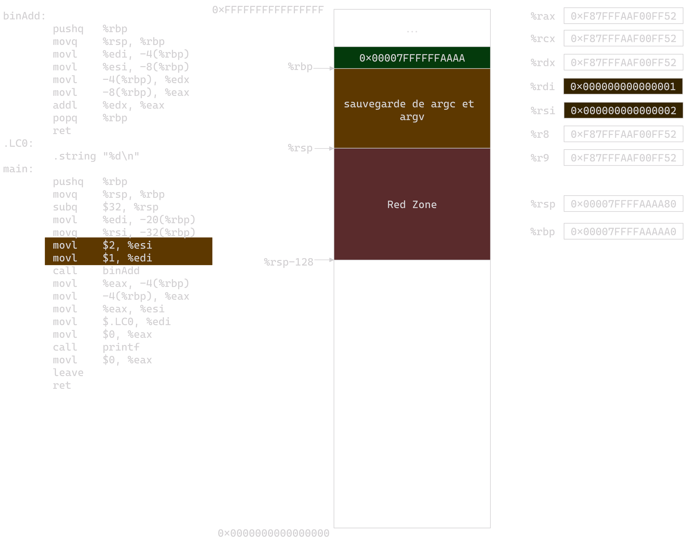
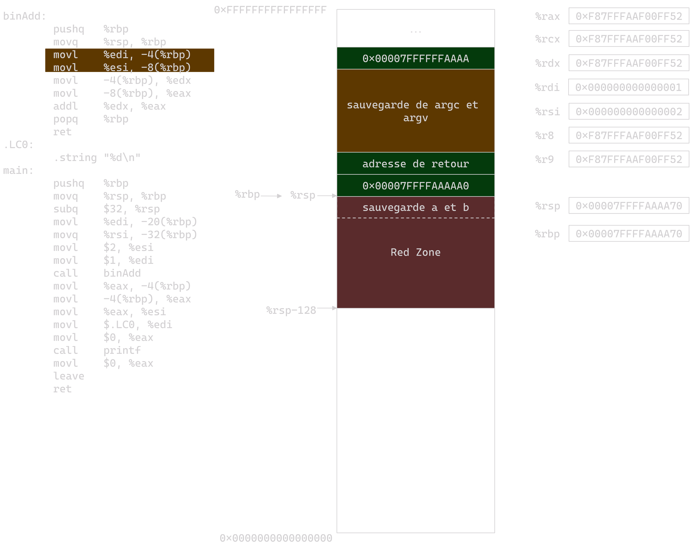
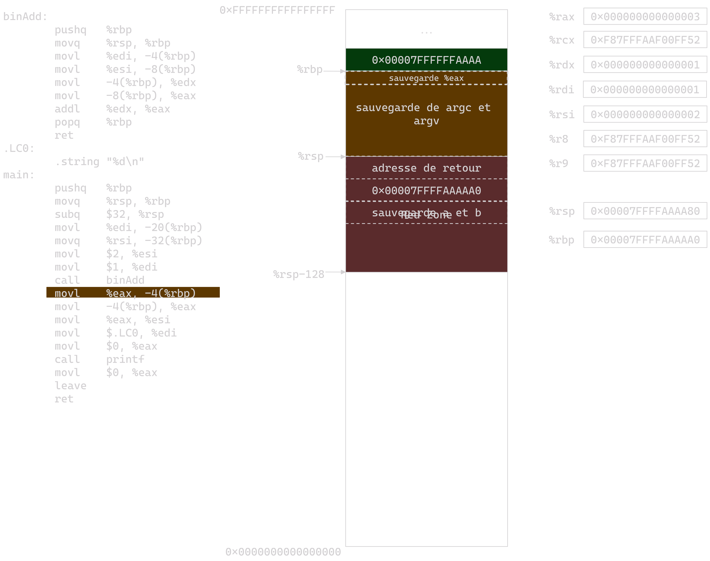

---
presentation:
    width: 2000
    height: 2000
    theme: night.css
      # Factor of the display size that should remain empty around the content
    margin: 0

  # Display controls in the bottom right corner
    controls: true

  # Display a presentation progress bar
    progress: true
    keyboard: true

---

<!-- slide -->

<!-- slide -->

<!-- slide -->

<!-- slide -->

<!-- slide -->

<!-- slide -->

<!-- slide -->

<!-- slide -->

<!-- slide -->

<!-- slide -->

<!-- slide -->

<!-- slide -->

<!-- slide -->

<!-- slide -->

<!-- slide -->

<!-- slide -->

<!-- slide -->

<!-- slide -->

<!-- slide -->
