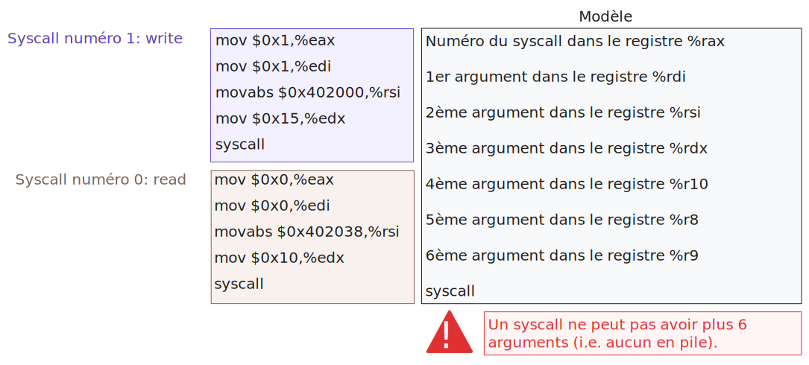

# Les fonctions en x86_64

<!-- regex for links: [-a-zA-Z0-9@:%._\+~#= "/<>]+ -->
## Appeler les fonctions écrites en C compilée sous GNULinux

- Pour appeler des fonctions écrites en C de librairies comme la **libc** ou autres respectant l’ABI System V amd64, il suffit de suivre cette dernière.
> Si vous aves besoin d'*include* des headers spécifiques, veuillez bien nommer votre fichier avec l'extension `.S` et non `.s`. Autrement, le preprocessor ne sera pas appeler pour résoudre les *includes*, et votre programme ne fonctionnera pas.

### Fonction simple

- Mettre les arguments 1 à 6 dans les registres `%rdi`, `%rsi`, `%rdx`, `%rcx`, `%r8` et `%r9`, puis empiler le reste dans la pile du dernier au  **7ᵉ**.
- Faire un `call` avec le nom de la fonction voulue.
- Cette dernière va générer sa stack frame et devra retourner sa valeur de retour dans les registres `%rax` et `%rdx`, si c'est un entier.
  - Le registre `%rdx` est utilisé si la valeur de retour fait *plus de 8 octets*. 
- En cas d'arguments flottants, on utilisera les registres `%xmm0-7`. 
  - `xmm0` et `xmm1` pour les valeurs retours float ou double.
- Etant donné le code suivant:

```c
#include <stdio.h>

int binAdd(int a, int b){
    return a+b;
}

int main(int argc, const char **argv)
{
    int res = binAdd(1,2);
    printf("%d\n",res);
    return 0;
}
```

- En le compilant en `-O0` avec `clang` pour avoir le code assembleur sans optimisation, on obtient l'exécution suivante:

<center>
<iframe class="slideshow-iframe" id="execution-function" src="./_static/slides/function-sequence.html"
frameborder="0" scrolling="no"></iframe>
</center>

Pour comprendre comment la pile est séparée entre différentes fonctions, vous pouvez vous reférer à [Stack Frame](#stack-frame). Et pour plus de détails sur l'alignement de la pile demandé par l'ABI, rendez-vous sur [L'alignement de la pile en x86_64](x86_64-Alignement.md#lalignement-de-la-pile-en-x86_64).

### Fonction variadic (nombre d'arguments dynamique)

- Les fonctions ayant un nombre d'arguments non défini (comme *printf*), requirent l'utilisation du registre `%al` (`%rax`) pour spécifier le **nombre maximum** de registres de type vecteur que l'appel utilise. 
  - Le nombre doit être entre **0 et 8 inclus**, vu qu'on s'arrête au `xmm7`(commencant depuis `xmm0`) pour les arguments float avant de commencer à empiler les arguments en mémoire.
- Les registres de types vecteurs sont énormes (de 128 à 512 bits) et ne sont pas préservés entre les appels de fonctions. Donc, pour éviter de les sauvegarder inutilement quand la fonctions variadic ne les utilisent pas, on spécifie le nombre maximum de registres vecteurs (utilisés pour les arguments) que la fonction variadic doit sauvegarder, afin de garder ses arguments entre les appels de fonctions qu'elle lancera.
- Tout cela parce que le code de la fonction variadic est statique après la compilation (le même code pour tous les appels possibles) et donc pour **palier** à tous les cas de figures elle doit enregistrer tous les registres susciptible d'avoir des arguments (vu qu'elle ne connait le nombre qu'à l'appel) d'où l'interêt d'utiliser `%al` pour optimiser son empreinte mémoire.

- Etant donné le code suivant:

```c
#include <stdio.h>


int main(int argc, const char **argv)
{
    printf("%d+%d=%d\n",45,40,45+40);
    printf("%f*%f=%f", 3.1,2.0,3.1*2.0);
    return 0;
}

```

- On obtient l'assembleur:

```nasm
.LC0:
        .string "%d+%d=%d\n"
.LC4:
        .string "%f*%f=%f"
main:
        subq    $8, %rsp
        movl    $85, %ecx
        movl    $40, %edx
        movl    $45, %esi
        movl    $.LC0, %edi
        movl    $0, %eax ; mettre 0 dans al vu qu'on n'utilise aucun float
        call    printf

        movsd   .LC1(%rip), %xmm2
        movsd   .LC2(%rip), %xmm1
        movsd   .LC3(%rip), %xmm0
        movl    $.LC4, %edi
        movl    $3, %eax; 3 étant le nombre de registre xmm utilisés par l'appel
        call    printf

        movl    $0, %eax
        addq    $8, %rsp
        ret
.LC1:
        .long   -858993459
        .long   1075367116
.LC2:
        .long   0
        .long   1073741824
.LC3:
        .long   -858993459
        .long   1074318540
```

- Vous remarquerez que le compilateur a fait lui même les calculs et le code finale ne fait qu'afficher des immédiats (les floats sont stockés avec la directive .long). Normalement un float fait 4 octets, mais là le compilateur remplie les registres `%xmm` de 16 octets. Ces derniers sont des registres de 128-bits, permettant du SIMD, mais pour ne pas compliquer le code, il les remplie au maximum. C'est un comportement unique à GCC, CLANG le fait différement. Je vous laisse le plaisir de vérifier sur [godbolt](https://godbolt.org).
- Pour ce qui est des appel `.LC1(%rip)`, ... ceux sont des accès mémoire relatifs au `%rip` pour avoir un code indépendant de son adresse de début.

<blockquote class="small-text">
Références:
<ul>
<li><a href="https://stackoverflow.com/questions/30412676/returning-function-arguments-from-assembly">https://stackoverflow.com/questions/30412676/returning-function-arguments-from-assembly</a></li>
</ul>
</blockquote>

## Syscalls en assembleur
- Si vous lisez la description de l'instruction <a href="https://www.felixcloutier.com/x86/syscall" target="_blank"><code class=" docutils literal notranslate">syscall</code></a> dans le manuel d'intel, vous trouverez la phrase *"Fast call to privilege level 0 system procedures."*. Ils la décrivent comment étant rapide, par rapport à l'ancienne implémentation où le syscall était une interruption lambda et le CPU devait vérifier le type de l'interruption à chaque fois.
- Sinon pour faire court, c'est l'instruction assembleur utilisée pour faire appel à un syscall défini par l'OS qui va s'exécuter en mode Kernel (d'où le privilege level 0).
- Vous remarquerez que plusieurs registres sont initialisés avant l'instruction syscall. Je cite l'abi:
> User-level applications use as integer registers for passing the sequence `%rdi`, `%rsi`, `%rdx`, `%rcx`, `%r8` and `%r9`. The kernel interface uses `%rdi`, `%rsi`, `%rdx`, `%r10`, `%r8` and `%r9`.

Notez l'utilisation de `%r10` à la place de `%rcx` pour passer en mode kernel (appel système).

<center><div  class="figure-container"><figure>

<figcaption>Illustration expliquant l'utilisation d'un syscall</figcaption>
</figure></div></center>

- Le syscall conservera tous les registres sauf **3**:
  - `%rax` contenant la valeur de retour.
  - `%rcx` contenant l'adresse de retour, i.e l'adresse de l'instruction après `syscall`.
  - `%r11` sauvegardant les valeurs des flags `%rflags`.

- En cas d'erreur, la valeur de retour dans `%rax` est comprise dans l'intervalle **[-4095,-1]**, chacune pouvant être traduite en un code d'erreur de type **errno**. Pour vérifier si le syscall retourne une erreur en assembleur on utilise les deux instructions suivantes:

```nasm
   cmp $-4095, %rax
   jae errorSyscall
```

:::{admonition} Pourquoi jae ?
:class: dropdown, tip
- L'instruction <a href="https://www.felixcloutier.com/x86/jcc" target="_blank"><code class=" docutils literal notranslate">jae</code></a> vérifie si la valeur **non signée** dans `%rax` est supérieure ou égale à la valeur **non-signée** de `-4095`.
- En 64-bits (**0b** veut dire nombre binaire):
  -  **-4095**  = 0b**1**111111111111111111111111111111111111111111111111111**00000000000**1 = 184467440737095**47521**
  -  **-1**     = 0b**1**111111111111111111111111111111111111111111111111111**11111111111**1 = 184467440737095**51615**
  -  **0**      = 0b**0**000000000000000000000000000000000000000000000000000000000000000 = **0**
- Les nombres négatifs commencent tous par **1** les rendant supérieurs aux nombre positifs quand on les compare en utilisant leurs valeurs **non signées**. Ajoutant à cela le fait que les representations négatives ont leur valeur **non signée** croître quand on se rapproche de **0**. 
- Avec ces deux notions, il devient clair que l'instruction `jae` ne saute que si la valeur de `%rax` est dans l'intervale **[-4095,-1]**.
  - Si `%rax` a une valeur non signée **inférieure** à celle de **-4095**, cela voudra dire qu'il est soit **positif**, **0**, ou bien, **négatif** avec une valeur **signée** **inférieur** à **-4095**.
  - Autrement, sa valeur non signée sera **égale** ou **supérieure** à celle de **-4095**, avec comme maximum celle de **-1** (que des bits 1).
:::

- Pour voir les différents syscalls disponible sur le kernel linux pour l'architecture x86-64, regardez <a href="https://github.com/torvalds/linux/blob/master/arch/x86/entry/syscalls/syscall_64.tbl" target="_blank">cette page github</a>. Et pour avoir une idée sur les arguments de chaque syscall il existe <a href="https://blog.rchapman.org/posts/Linux_System_Call_Table_for_x86_64/" target="_blank">cette page de blog</a> très bien écrite, mais malheureusement elle n'est plus à jour. Vous pouvez aussi vous référez à <a href="https://x64.syscall.sh/" target="_blank">https://x64.syscall.sh/</a>.

:::{tip}
Pour trouver le numéro d'un syscall sans accès à internet, vous pouvez soit utiliser les macros `__NR_syscallname` définies dans le header `<sys/syscall.h>`. Par exemple, le numéro du syscall *open* est définie comme `__NR_open`. Par contre, il faut faire attention à bien utiliser l'extension `.S` pour votre fichier assembleur pour qu'`as` gére les `#include`. Si vous n'arrivez pas à utiliser ses macros, on peut récuperer leur définition avec un petit pipe via gcc:
```bash
# -E pour demander à gcc de s'arrêter au preprocessing,
#-dM pour qu'il montre les définition de macros, 
# -x c pour dire que c'est du C,
# et - pour qu'il lise le stdin.
echo "#include <sys/syscall.h>" | gcc -E -dM -x c - | grep "^#define __NR_open"
# vous pouvez rajouter -w à grep pour avoir que le match parfait
echo "#include <sys/syscall.h>" | gcc -E -dM -x c - | grep -w "^#define __NR_open"
```
:::

<blockquote class="small-text">
Références:
<ul>
<li><a href="https://stackoverflow.com/questions/38751614/what-are-the-return-values-of-system-calls-in-assembly" target="_blank">https://stackoverflow.com/questions/38751614/what-are-the-return-values-of-system-calls-in-assembly</a></li>
<li><a href="https://stackoverflow.com/questions/50571275/why-does-a-syscall-clobber-rcx-and-r11" target="_blank">https://stackoverflow.com/questions/50571275/why-does-a-syscall-clobber-rcx-and-r11</a></li>
<li><a href="https://gitlab.com/x86-psABIs/x86-64-ABI" target="_blank">https://gitlab.com/x86-psABIs/x86-64-ABI [Appendix A]</a></li>
</ul>
</blockquote>

## Stack frame

- Il se peut que vous ayez entendu ou lu la phrase *“chaque fonction possède une pile (stack) où elle stocke (alloue) ses variables locales”*. En vrai, quand on parle de fonction, on fait surtout allusion à une *“stack frame”*. Une stack frame représente une **partie** bien définie de la pile(stack) *complète* d’une tâche (un thread).

- L’architecture x86_64 contient deux registres utilisés pour la gestion de la pile `%rbp`**(base pointer)** et `%rsp`**(stack pointer)**. On pourrait se demander pourquoi avoir deux registres pour gérer une pile, alors qu’un seul suffirait. Effectivement, le registre `%rsp` suffit largement pour accéder aux données présentes dans la pile. Par contre, la pile pouvant croitre et décroitre, on se doit de faire extrêmement attention au calcul des décalages par rapport à l’adresse présente dans le registre `%rsp`. Un compilateur peut s'en sortir, mais cela complexifie le débogage et introduit des cassements de têtes au programmeur qui veut toucher au code assembleur.

```{note}
En C99, fu introduit le VLA pour "Variable Length Array". Un moyen d'avoir un tableau en pile avec une taille connu qu'à l'exécution! VLA rend le pointeur `%rsp` ingérable, i.e. on ne peut pas savoir où il va être à la compilation. Donc, on ne peut pas calculer le décalage des données dans la pile par rapport à `%rsp`. On n'a pas d'autres choix que d'utiliser `%rbp`.

**Même si c'est possible de créer ce genre de tableaux, il est recommendé de ne pas les utiliser. Ils peuvent facilement causer des *"stack overflows"*.**
```
  
- Comme vous le savez déjà, la pile sert aussi à stocker l’adresse de retour d’une fonction et aussi *certains* de ses arguments (à partir du 7ᵉ argument). Alors, pour simplifier l’accès à ces arguments, on utilise le registre `%rbp` pour spécifier la *base* d’une stack frame (où elle commence). Et le registre `%rsp` va être décrémenté et incrémenté comme bon nous semble, indiquant le *sommet* de la pile. En utilisant le registre `%rbp`, on pourra accéder aux arguments ou aux variables locales **sans avoir à recalculer les décalages (offsets)** à chaque fois que `%rsp` change.

- Comme le montre la figure ci-dessous, lors de l'exécution d'une fonction, le `%rbp` contient l’**adresse** où l’**ancien** `%rbp` est **stocké**, une **incrémentation** de **8** permet toujours d’avoir l'**adresse** **où** **est** **l’adresse de retour**, et de **16** pour avoir l'**adresse** du **7ᵉ argument** (s'il existe)(les arguments sont empilés de droite à gauche). Une **décrémentation** d’un certain nombre d’octets permet d’accéder aux registres sauvegardés ou aux variables locales allouées par la décrémentation du `%rsp`.

```{figure} ./_static/images/StackFrame.svg
:align: center
:alt: Illustration d'un exemple de stack frame de l'abi linux amd64.
Illustration d'un exemple de stack frame de l'abi linux amd64.
```

- Pour résumer, lors d'un appel de fonction, les arguments à partir du 7ᵉ sont empilés par la fonction appelante. Ce 7ᵉ argument s'il existe marquera la fin de la stack frame de la fonction appelante avec son octet de poids faible. L'adresse de retour est empilée par l'instruction `call` et son octet de poids fort marque le début de la stack frame de la fonction appelée.
  - **La Prologue:** Après le `call`, c'est le code de la fonction appelée qui s'exécute, ainsi, il est responsable de la sauvegarde de `%rbp` et de sa mise à jour.
   ```nasm
   my_func:
      pushq %rbp ; %rsp pointe vers la sauvegarde de %rbp
      movq %rsp, %rbp ; %rbp pointe vers son ancienne valeur
   ```
  - **L'Épilogue:** À la sortie de la fonction, les variables locales doivent être **désallouées** et les registres **sauvegardés** (dont `%rbp`) doivent être **restaurés**. Une fois arrivé à l'instruction `ret` le registre `%rsp` **doit pointer vers l'adresse de retour**.
   ```nasm
      ; ...
      movq %rbp, %rsp ; %rsp pointe vers l'ancienne valeur de %rbp
      popq %rbp ; le précédent %rbp est restauré, %rsp pointe vers l'adresse de retour
      ret
   ```

### enter et leave

- L'architecture x86_64 propose deux instructions <a href="https://www.felixcloutier.com/x86/enter" target="_blank"><code class=" docutils literal notranslate">enter</code></a> et <a href="https://www.felixcloutier.com/x86/leave" target="_blank"><code class=" docutils literal notranslate">leave</code></a> pour gérer le prologue et l'épilogue d'une fonction.
- L'instruction `enter` prend deux immédiats comme opérant, le premier (de 16-bits) spécifiant la taille à allouer dans la pile pour les registres à sauvegarder et les variables locales. Le deuxième est utilisé pour les fonctions imbriquées (une fonction définie à l'intérieur d'une autre) qui doivent avoir accès aux variables locales de leur fonction mére. 
- En utilisation simple, `enter` peut remplacer la suite de trois instructions: `push %rbp`, `movq  %rsp, %rbp`, `sub  imm16, %rsp`. Mais, comme l'explique si bien <a href="https://stackoverflow.com/questions/5959890/enter-vs-push-ebp-mov-ebp-esp-sub-esp-imm-and-leave-vs-mov-esp-ebp" target="_blank">ce post sur stackoverflow</a>, `enter` n'est qu'un vestige du passé maintenue uniquement pour la rétrocompatibilité et est en réalité moins performant en temps d'exécution que nos trois instructions.
- Pour ce qui de l'instruction `leave` elle est équivalente à la suite d'instruction `movq %rbp, %rsp`, `popq %rbp`. Elle est toujours valable, mais les compilateurs l'utilisent de moins en moins. Elle reste une instruction vieillissante, qui n'est pas aussi optimisée que `mov` et `pop` réunies. La différence reste négligeable mais les developpeurs ont fait le choix de ne plus trop l'utiliser, même si elle permet d'avoir une plus petite empreinte mémoire pour le code.

```{admonition} À garder en tête
:class: important
Avoir moins d'instructions dans un processeur CISC permet d'avoir une meilleure empreinte mémoire (code moins volumineux). Par contre ça ne dit rien quant à la vitesse d'exécution du code. Du coup, avoir moins d'instructions ne veut pas toujours dire avoir un code s'éxécutant plus rapidement.
```

### La red zone

- L'ABI Linux AMD64 fait en sorte de garder **intacts les 128 octets** juste après le sommet de la pile (`%rsp`) en cas d'**interruption** ou de **réception de signal**. Cela permet d'avoir à notre disposition **128 octets** pré-alloués pour des données **temporaires** qui resteront inchangées même **après la gestion d'une interruption ou d'un signal**.

- **En quoi cela est-il important ?** Un processeur, lors de son exécution, peut facilement être interrompu pour ne plus exécuter une fonction, mais plutôt le code gérant un signal ou une interruption reçue. Pour rappel, c'est sur le chemin de retour depuis le mode noyau que tout cela est vérifié et déclenché.

- Il est **important** que ces données temporaires **ne soient pas utilisées entre des appels de fonctions**, vu que la stack frame d'une fonction appelée va **utiliser** ces 128 octets de la red zone. Il faut aussi garder en tête que **la red zone se déplace avec le** `%rsp`.

- Dans le cas d'une fonction dite **leaf** (qui ne fait pas d'appel de fonction), elle peut utiliser la red zone de la fonction appelante pour toute sa stack frame en n'utilisant que le `%rsp` comme point de référence, vu qu'il ne changera pas (sauf si besoin de plus de 128 octets). Ainsi, on n'a pas à gérer le `%rbp`, et cela nous **économise** quelques instructions.

```{warning}
Sachez que le déréférencement d'adresse sous le `%rsp` peut causer pas mal de bugs; ne le faite pas !! La red zone est juste une astuce de Linux voulant proposer certaines optimisations.
```

```{admonition} Notes Pratiques
:class: tip
- Quand gcc compile du C, il essaie d'introduire des optimisations en n'utilisant les stack frames que quand nécessaire. 
- Le flags `-fno-omit-frame-pointer`, permet de suggérer à gcc de définir une stack frame pour chaque appel de fonction. Par contre, il peut juger inutile sa définition dans certains cas(les leaf functions par exemple).
- Le flag `-fomit-frame-pointer` de gcc, permet d'avoir un code avec une utilisation minimale du stack frame (sauf si obligatoire), autrement dit, il pourra utiliser le registre `rbp` pour autre chose que la gestion des stack frame. 
  - Néanmoins, il ne peut être utilisé qu'avec certains langages comme le C, d'autres langages nécessitent la stack frame par design. Par exemple, le concept du unwinding (en C++ par exemple) permet de gérer les exceptions et de toujours appeler les destructeurs des variables locales à la sortie d'une fonction(ou fin d'un contexte) qui a levé une exception ou pas.
- Le flag `-mno-red-zone` permet de désactiver la red zone.
```

<blockquote class="small-text">
Références:
<ul>
<li><a href="https://gitlab.com/x86-psABIs/x86-64-ABI">https://gitlab.com/x86-psABIs/x86-64-ABI</a></li>
<li><a href="https://softwareengineering.stackexchange.com/questions/230089/what-is-the-purpose-of-red-zone">https://softwareengineering.stackexchange.com/questions/230089/what-is-the-purpose-of-red-zone</a></li>
<li><a href="https://stackoverflow.com/questions/26323215/do-any-languages-compilers-utilize-the-x86-enter-instruction-with-a-nonzero-ne">https://stackoverflow.com/questions/26323215/do-any-languages-compilers-utilize-the-x86-enter-instruction-with-a-nonzero-ne</a></li>
<li><a href="https://stackoverflow.com/questions/5959890/enter-vs-push-ebp-mov-ebp-esp-sub-esp-imm-and-leave-vs-mov-esp-ebp">https://stackoverflow.com/questions/5959890/enter-vs-push-ebp-mov-ebp-esp-sub-esp-imm-and-leave-vs-mov-esp-ebp</a></li>
<li><a href="https://stackoverflow.com/questions/2331316/what-is-stack-unwinding">https://stackoverflow.com/questions/2331316/what-is-stack-unwinding</a></li>
<li><a href="https://www.bogotobogo.com/cplusplus/stackunwinding.php">https://www.bogotobogo.com/cplusplus/stackunwinding.php</a></li>
</ul>
</blockquote>