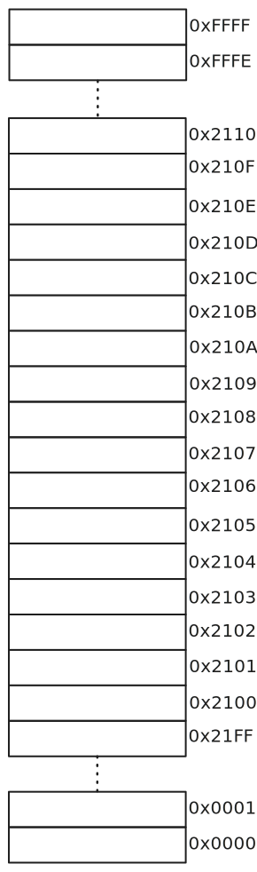
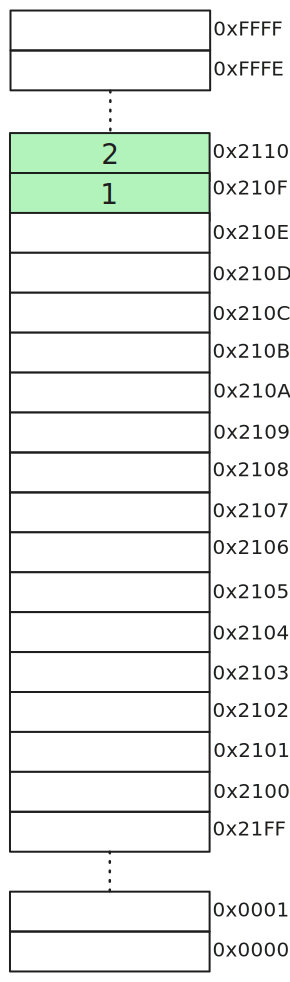
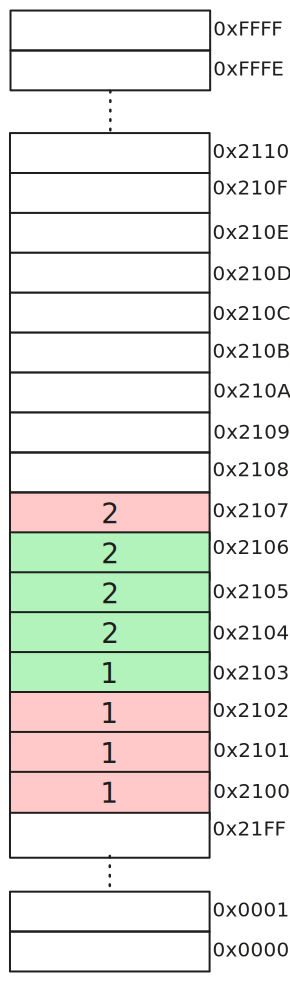
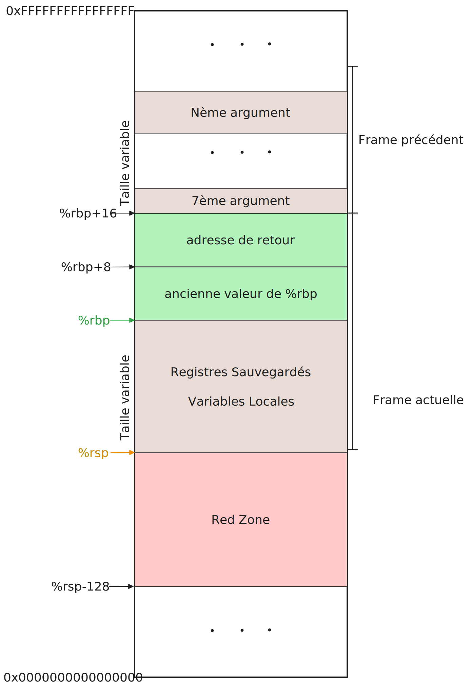

# Les fonctions en x86_64

## L'alignement de la pile en x86_64

### Rappel sur l'adressage de la RAM

La mémoire vive (RAM) est adressable par octet, ce qui signifie qu'une adresse correspond à un octet unique. À titre de comparaison, les SSD, bien que très rapides, sont utilisés comme mémoire secondaire car leur gestion interne se fait par blocs, et non par octet. Cependant, au *niveau logiciel*, il est possible d'accéder à des données de taille *inférieure* à un bloc, mais les transactions coûtent aussi chers vu qu'en vrai on travaille un bloc.

Lorsque l'on souhaite récupérer plusieurs octets consécutifs en RAM, deux méthodes principales existent :  
1. Effectuer plusieurs déréférencements successifs (peu efficace).  
2. Utiliser un accès aligné, permettant de récupérer plusieurs octets en une seule opération.

Considérons une mémoire de \(2^{16}\) octets (64 Ko), avec des adresses sur 16 bits.

<center><div  class="figure-container-small">
<figure>
    
</figure>
</div></center>

 Si l’on veut lire l'octet à l'adresse `0x210F`, une seule requête est nécessaire. Cependant, pour accéder à deux octets à partir de cette adresse (`0x210F` et `0x2110`), il faudra effectuer deux requêtes, car les deux octets ne se trouvent pas sur une adresse alignée pour une lecture de 2 octets.

 <center><div  class="figure-container-small">
<figure>
    
    
</figure>
</div>
</center>

Si les deux octets commencent à une adresse alignée, comme `0x210E`, et que le controlleur mémoire supporte les accés dit alignés, il est possible de les lire en une seule fois. Une adresse alignée pour des données de 2 octets est un multiple de \(2^1\) :  
`0x210E = 0b0010 0001 0000 1110` (le dernier bit est 0, indiquant un multiple de \(2^1\)).

Ainsi, les processeurs (et leurs contrôleurs mémoire) peuvent optimiser les accès alignés, en réduisant les requêtes nécessaires.

Une donnée de taille \(N\) doit généralement être adressée par une adresse multiple de \(N\). Par exemple, pour un entier (`int`) de 4 octets, l’adresse doit être un multiple de 4. Cette règle permet aux processeurs de maximiser l’efficacité des accès mémoire. Par exemple, parmis les adresses dans notres schémas, une données de 16 octets (`long double`) devrait être stocké soit à partir de `0x0000`,`0x2100` ou `0x2110` (on a besoin que les 4 derniers bits soit à 0).

<center><div  class="figure-container-small">
<figure>
    
</figure>
</div></center>

Cependant, l'alignement strict dépend des architectures :
- **x86 (Intel/AMD)** : Tolère les accès non alignés, mais avec une légère pénalité de performance. Le processeur peut gérer les accès en plusieurs cycles mémoire si nécessaire.
- **M68k (premiers processeurs)** : Génère une exception en cas d’accès non aligné. Cela imposait des contraintes strictes sur le placement des données en mémoire.
- **Systèmes embarqués simples** : Certains processeurs n'imposent pas d’alignement strict mais subissent des ralentissements en conséquence.

**Impact des accès non alignés :** Même sur des processeurs comme le x86, les accès non alignés restent plus lents qu’un accès aligné, car ils peuvent nécessiter des lectures multiples et des opérations supplémentaires pour assembler les données.

Les processeurs lisent souvent des blocs de mémoire plus larges que la taille exacte des données demandées. Par exemple :
- Si un processeur charge toujours 4 octets à la fois, une adresse `0x210F` sera interprétée comme `0b0010 0001 0000 11XX` (en ignorant les deux derniers bits), où X peut être 1 ou 0. Ainsi, les octets chargés seront : `0x210C`, `0x210D`, `0x210E`, et `0x210F`.
- Si un entier (`int`: 4 octets) commence à l'adresse `0x2103`, deux lectures de 4 octets seront nécessaires :
  1. `0x2100` à `0x2103`.
  2. `0x2104` à `0x2107`.  
  Ensuite, le processeur assemblera les octets nécessaires (il a chargé 4 octets inutiles!).
- Si l'entier commence à une adresse alignée comme `0x2104`, une seule lecture suffira.

<center><div  class="figure-container-small">
<figure>
    
    
</figure>
</div></center>

Les processeurs modernes ont pratiquement tous de la mémoire cache. Et Ils utilisent des techniques comme le préchargement (pré-fetching) pour anticiper les besoins en données. Cela consiste à charger plusieurs octets d’un coup pour remplir une ligne de cache, typiquement de 64 octets. Si une donnée de 16 octets est mal alignée, le processeur devra :
1. Charger une première ligne de cache de 64 octets contenant une partie des données.
2. Charger une seconde ligne de cache de 64 octets contenant le reste des données.
Ainsi une donnée qui aurait pu tenir dans une seule ligne de cache génère deux requêtes mémoire, augmentant le temps d’accès et diminuant les performances.


<blockquote class="small-text">
Références:
<ul>
<li><a href="https://developer.ibm.com/articles/pa-dalign/" target="_blank">https://developer.ibm.com/articles/pa-dalign/</a></li>
</blockquote>


### Comprendre l'alignement de la pile en Linux AMD64

Sur les architectures x86_64 (AMD64), la norme ABI (Application Binary Interface) System V impose que la pile soit alignée sur **16 octets** avant l'exécution d'une fonction.

Dans l'abi on a: 
> In addition to registers, each function has a frame on the run-time stack. This stack grows downwards from high addresses. Figure 3.3 shows the stack organization. The end of the input argument area shall be aligned on a 16 (32 or 64, if __m256 or __m512 is passed on stack) byte boundary. In other words, the value (%rsp + 8) is always a multiple of 16 (32 or 64) when control is transferred to the function entry point. The stack pointer, %rsp, always points to the end of the latest allocated stack frame.

Je vais vous expliquer le paragraphe, petit à petit avec de meilleurs schémas:

> In addition to registers, each function has a frame on the run-time stack. This stack
grows downwards from high addresses.

Chaque fonction à une stack frame (une section de la pile du processus) qui commence à une adresse haute qui est decrementée à chaque allocation (sauvegarde de registes ou allocations de variables locales).

> The end of the input argument area shall be aligned on a 16 (32 or 64, if __m256 or __m512 is passed on stack) byte boundary.

Une fois tous les arguments empilés (du 7ème au n-ème), l'adresse mémoire dans %rsp (le sommet de la pile) doit être alignée sur 16 (32 ou 64) dependant des types de données empilé. Dans notre cas on ne va pas utilisé les types `__m256` et `__m512` qui sont utilisés pour les instructions SIMD (Single Instruction Multiple Data).

> In other words, the value `(%rsp + 8)` is always a multiple of 16 (32 or 64) when control is transferred to the function entry point. The stack pointer, `%rsp`, always points to the end of the latest allocated stack frame.

Ici le paragraphe parle de la valeur de `%rsp` directement après que l'adresse de retour fu empilée. La valeur de `%rsp + 8` represente ainsi l'**adresse** où *l'adresse de retour* est stockée. Ainsi la conclusion est: 

<center> <blockquote class="conclusion">Avant un <code>call</code> la pile doit être alignée sur 16! </blockquote></center>

Prennant le programme Hello World comme exemple:

```nasm
    .global main

    .text
main:
    sub     $8, %rsp
    movq    $message, %rdi
    call    puts
    mov     $0, %rax
    add     $8, %rsp
    ret

message:
    .asciz "Hello, world!"
```

> Les figures suivantes utilisent des adresses sur 32-bits une lecture plus facile.

Pour commencer, il faut savoir qu'il existe une hypothèse forte sur l'état initiale. On suppose que le bootstrapper qui appel `main` a respecté l'ABI, et ainsi avant `call main` le sommet de la pile `%rsp` était alignée sur 16.

<center><div  class="figure-container-small">
<figure>
    
</figure>
</div></center>

Vu que le `call` **push** la valeur de `%rip` dans la pile (une adresse de 8 octets), le sommet de la pile `%rsp` perd son alignement sur 16 pour un alignement sur 8.

<center><div  class="figure-container-small">
<figure>
    
</figure>
</div></center>

Du coup, pour avoir un alignement sur 16 avant de faire `call puts` il faut décrementer le `%rsp` de 8 pour avoir une decrementation de 16 au total (le **push** de `call main` + notre décrementation). On peut faire cela rapidement par:
- un **push** d'un registre de 8 octets.
- ou une soustraction de 8 sur `%rsp`.

<center><div  class="figure-container-small">
<figure>
    
</figure>
</div></center>

L'histoire se répète pour le `call puts`, le sommet de pile perd son alignement sur 16 aprés le `call` et le retrouve au `ret` de `puts`. Le `%rsp` pointera sur les données rouges au retour de `puts`.

Maintenant, pour que le `ret` de `main` puisse **pop** la bonne adresse de retour, on doit placer `%rsp` sur le debut de l'adresse de retour. Sinon on lira d'autres données binaires comme l'adresse de retour, et le `%rip` peut se retrouver de l'autre côté de la galaxy.

#### Mais pourquoi faire simple quand on peut faire compliqué ?

<!-- La pile (stack) est une zone mémoire utilisée par les programmes pour gérer les appels de fonction, les variables locales, et les adresses de retour. Sur x86_64, la pile croît **vers les adresses basses** : chaque allocation réduit la valeur du pointeur de pile `%rsp`. L'ABI stipule que juste avant qu'une fonction ne commence son exécution, la valeur `%rsp + 8` (c'est-à-dire le sommet effectif de la pile, où est stockée l'adresse de retour) doit être un multiple de 16. -->

Des fois, on n'a pas le choix. L'idée derrière cet alignement de 16 octets est directement liée à la gestion des données SIMD (Single Instruction, Multiple Data), en particulier les instructions SSE (Streaming SIMD Extensions) et AVX. Ces instructions, utilisées pour des calculs vectoriels, manipulent des blocs de données de 16 ou 32 octets. En pratique, les opérations sur les flottants sont faites avec ces instructions. Si ces blocs ne sont pas alignés correctement en mémoire, cela peut entraîner une dégradation des performances ou même des erreurs sur des architectures anciennes.

**L'importance de l'alignement:**
> Imaginez que le processeur doit charger un bloc de 16 octets pour une instruction SIMD. Si ce bloc commence à une adresse non alignée, plusieurs requêtes mémoire sont nécessaires pour rassembler les données, ce qui ralentit l'exécution. L'alignement garantit que ces blocs peuvent être chargés en une seule opération, optimisant ainsi les performances. 

**Encore plus important:**
> Sur certaines architectures plus anciennes ou strictes, comme avec les versions SSE1 et SSE2 de x86, un accès mal aligné pouvait provoquer une exception fatale. 

Dans l'ABI System V, l'alignement de 16 octets garantit que les instructions SSE, qui utilisent les registres XMM pour des blocs de 128 bits (16 octets), fonctionnent sans problème (pas de segfault). De plus, les extensions AVX, qui opèrent sur des blocs encore plus grands (256 bits ou 512 bits), renforcent cette nécessité avec un alignement de 32 ou 64 octets dans des cas spécifiques.

Si vous vous demandez pourquoi une fonction semble fonctionner dans certains cas et planter dans d'autres, pensez à vérifier l'alignement de la pile. Des forums comme [Stack Overflow](https://stackoverflow.com/questions/49391001/why-does-the-x86-64-amd64-system-v-abi-mandate-a-16-byte-stack-alignment) ou [ce cas spécifique](https://stackoverflow.com/questions/51070716/glibc-scanf-segmentation-faults-when-called-from-a-function-that-doesnt-align-r) sur `scanf` montrent bien que des erreurs subtiles peuvent survenir à cause de ce détail souvent négligé.

<blockquote class="small-text">
Références:
<ul>
<li><a href="https://stackoverflow.com/questions/49391001/why-does-the-x86-64-amd64-system-v-abi-mandate-a-16-byte-stack-alignment" target="_blank">https://stackoverflow.com/questions/49391001/why-does-the-x86-64-amd64-system-v-abi-mandate-a-16-byte-stack-alignment</a></li>
<li><a href="https://stackoverflow.com/questions/51070716/glibc-scanf-segmentation-faults-when-called-from-a-function-that-doesnt-align-r" target="_blank">https://stackoverflow.com/questions/51070716/glibc-scanf-segmentation-faults-when-called-from-a-function-that-doesnt-align-r</a></li>
</blockquote>


## Stack frame

- Il se peut que vous ayez entendu ou lu la phrase *“chaque fonction possède une pile (stack) où elle stocke (alloue) ses variables locales”*. En vrai, quand on parle de fonction, on fait surtout allusion à une *“stack frame”*. Une stack frame représente une **partie** bien définie de la pile(stack) *complète* d’une tâche (un thread).

- On a vu que l’architecture x86_64 contient deux registres utilisés pour la gestion de la pile **rbp(base pointer)** et **rsp(stack pointer)**. On pourrait se demander pourquoi avoir deux registres pour gérer une pile, alors qu’un seul suffirait. Effectivement, le registre **rsp** suffit largement pour accéder aux données présentes dans la pile. Par contre, la pile pouvant croitre et décroitre, on se doit de faire extrêmement attention au calcul des décalages par rapport à l’adresse présente dans le registre **rsp**. Un compilateur peut gérer cela, mais cela complexifie le débogage et introduit des cassements de têtes au programmeur qui veut toucher au code assembleur.
  
- Comme vous le savez déjà, la pile sert aussi à stocker l’adresse de retour d’une fonction et aussi *certains* de ses arguments (à partir du 7ᵉ argument). Alors, pour simplifier l’accès à ces arguments, on utilise le registre **rbp** pour spécifier la *base* d’une stack frame (où elle commence). Et le registre **rsp** va être décrémenté et incrémenté comme bon nous semble, indiquant le *sommet* de la pile. En utilisant le registre **rbp**, on pourra accéder aux arguments ou aux variables locales **sans avoir à recalculer les décalages (offsets)** à chaque fois que **rsp** change.

- Comme le montre la figure ci-dessous, lors de l'exécution d'une fonction, le **rbp** contient l’**adresse** où l’**ancien** **rbp** est **stocké**, une **incrémentation** de **8** permet toujours d’avoir l'**adresse** **où** **est** **l’adresse de retour**, et de **16** pour avoir l'**adresse** du **7ᵉ argument** (s'il existe)(les arguments sont empilés de droite à gauche). Une **décrémentation** d’un certain nombre d’octets permet d’accéder aux registres sauvegardés ou aux variables locales allouées par la décrémentation du **rsp**.

<center><div  class="figure-container"><figure>
    
    <figcaption>Illustration d'un exemple de stack frame de l'abi linux amd64.</figcaption>
</figure></div></center>

- Pour résumer, lors d'un appel de fonction, les arguments à partir du 7ᵉ sont empilés par la fonction appelante. Ce 7ᵉ argument s'il existe marquera la fin de la stack frame de la fonction appelante avec son octet de poids faible. L'adresse de retour est empilée par l'instruction `call` et son octet de poids fort marque le début de la stack frame de la fonction appelée.
  - **La Prologue:** Après le `call`, c'est le code de la fonction appelée qui s'exécute, ainsi, il est responsable de la sauvegarde de **rbp** et de sa mise à jour.
   ```nasm
   my_func:
      pushq %rbp ; %rsp pointe vers la sauvegarde de %rbp
      movq %rsp, %rbp ; %rbp pointe vers son ancienne valeur
   ```
  - **L'Épilogue:** À la sortie de la fonction, les variables locales doivent être **désallouées** et les registres **sauvegardés** (dont **rbp**) doivent être **restaurés**. Une fois arrivé à l'instruction `ret` le registre **rsp** **doit pointer vers l'adresse de retour**.
   ```nasm
      ; ...
      movq %rbp, %rsp ; %rsp pointe vers l'ancienne valeur de %rbp
      popq %rbp ; le précédent %rbp est restauré, %rsp pointe vers l'adresse de retour
      ret
   ```

### La red zone

- L'abi linux amd64 fait en sorte de garder intacte les **128 octets** juste après le sommet de la pile (**rsp**) en cas d'*interruption* de *réception de signal*. Cela permet d'avoir à notre disposition **128 octets** pré-alloués pour des données **temporaires** qui seront inchangées même *après la gestion d'une interruption ou signal*.
- Il est **important** que ces données temporaires **ne soient pas utilisées entre des appels de fonctions**, vu que la stack frame d'une fonction appelée va **utiliser** ces 128 octets précédemment intitulés red zone pour sa stack frame. Il faut aussi garder en tête que **la red zone bouge avec le rsp**.
- Dans le cas d'une fonction dite **leaf** (ne fait pas d'appel de fonction) elle pourra utiliser la red zone de la fonction appelante pour toute sa stack frame en n'utilisant que le **rsp** comme point de référence, vu qu'il ne changera pas (sauf si besoin de plus de 128 octets). Ainsi, on n'a pas à gérer le **rbp**, et cela nous *économise* quelques instructions.
   > Sachez que le déréférencement d'adresse sous le rsp peut causer pas mal de bugs, s'il est mal fait ou est inatendu; ne le faite pas !! La red zone est juste une gimmick de linux voulant proposer certaines optimisations.

> **Notes Pratiques:**
>- Quand gcc compile du C, il essaie d'introduire des optimisations en n'utilisant les stack frames que quand nécessaire. 
>  - Le flags `-fno-omit-frame-pointer`, permet de suggérer à gcc de définir une stack frame pour chaque appel de fonction. Par contre, il peut juger inutile sa définition dans certains cas(les leaf functions par exemple).
>- Le flag `-fomit-frame-pointer` de gcc, permet d'avoir un code avec une utilisation minimale du stack frame (sauf si obligatoire), autrement dit, il pourra utiliser le registre `rbp` pour autre chose que la gestion des stack frame. 
>  - Néanmoins, il ne peut être utilisé qu'avec certains langages comme le C, d'autres langages nécessitent la stack frame par design. Par exemple, le concept du unwinding (en C++ par exemple) permet de gérer les exceptions et de toujours appeler les destructeurs des variables locales à la sortie d'une fonction(ou fin d'un contexte) qui a levé une exception ou pas.
>- Le flag `-mno-red-zone` permet de désactiver les red zone.

### enter et leave

- L'architecture x86_64 propose deux instructions <a href="https://www.felixcloutier.com/x86/enter" target="_blank"><code class=" clickable">enter</code></a> et <a href="https://www.felixcloutier.com/x86/leave" target="_blank"><code class=" clickable">leave</code></a> pour gérer le prologue et l'épilogue d'une fonction.
- L'instruction `enter` prend deux immédiats comme opérant, le premier (de 16-bits) spécifiant la taille à allouer dans la pile pour les registres à sauvegarder et les variables locales. Le deuxième est utilisé pour les fonctions imbriquées (une fonction définie à l'intérieur d'une autre) qui doivent avoir accès aux variables locales de leur fonction mére. 
- En utilisation simple, `enter` tente de remplacer la suite de trois instructions: `push %rbp`, `movq  %rsp, %rbp`, `sub  imm16, %rsp`. Mais, comme l'explique si bien <a href="https://stackoverflow.com/questions/5959890/enter-vs-push-ebp-mov-ebp-esp-sub-esp-imm-and-leave-vs-mov-esp-ebp" target="_blank">ce post sur stackoverflow</a>, `enter` est qu'un vestige du passé maintenue uniquement pour la rétrocompatibilité et est en réalité moins performant en temps d'exécution que les trois instructions qu'il tente de remplacer.
- Pour ce qui de l'instruction `leave` elle est équivalente à la suite d'instruction `movq %rbp, %rsp`, `popq %rbp`. Elle est toujours valable, mais les compilateurs l'utilisent de moins en moins. Elle reste une instruction vieillissante, qui n'est pas aussi optimisée que `mov` et `pop` réunies. La différence reste négligeable mais les developpeurs ont fait le choix de ne plus trop l'utiliser, même si elle permet d'avoir une plus petite empreinte mémoire.

> **À garder en tête:** Avoir moins d'instructions permet d'avoir une meilleure empreinte mémoire (code moins volumineux), par contre ce ne dit rien quant à la vitesse d'exécution du code. Du coup, avoir moins d'instructions ne veut pas toujours dire avoir un code s'éxécutant plus rapidement.

<blockquote class="small-text">
Références:
<ul>
<li><a href="https://gitlab.com/x86-psABIs/x86-64-ABI">https://gitlab.com/x86-psABIs/x86-64-ABI</a></li>
<li><a href="https://softwareengineering.stackexchange.com/questions/230089/what-is-the-purpose-of-red-zone">https://softwareengineering.stackexchange.com/questions/230089/what-is-the-purpose-of-red-zone</a></li>
<li><a href="https://stackoverflow.com/questions/26323215/do-any-languages-compilers-utilize-the-x86-enter-instruction-with-a-nonzero-ne">https://stackoverflow.com/questions/26323215/do-any-languages-compilers-utilize-the-x86-enter-instruction-with-a-nonzero-ne</a></li>
<li><a href="https://stackoverflow.com/questions/5959890/enter-vs-push-ebp-mov-ebp-esp-sub-esp-imm-and-leave-vs-mov-esp-ebp">https://stackoverflow.com/questions/5959890/enter-vs-push-ebp-mov-ebp-esp-sub-esp-imm-and-leave-vs-mov-esp-ebp</a></li>
<li><a href="https://stackoverflow.com/questions/2331316/what-is-stack-unwinding">https://stackoverflow.com/questions/2331316/what-is-stack-unwinding</a></li>
<li><a href="https://www.bogotobogo.com/cplusplus/stackunwinding.php">https://www.bogotobogo.com/cplusplus/stackunwinding.php</a></li>
</ul>
</blockquote>

<!-- regex for links: [-a-zA-Z0-9@:%._\+~#= "/<>]+ -->
## Appeler les fonctions écrite en C compilée sous Linux

- Pour appeler des fonctions écrites en C de librairies comme la **libc** ou autres respectant l’ABI linux amd64, il suffit de suivre cette dernière.
> Si vous aves besoin d'*include* des headers spécifiques, veuillez bien nommer votre fichier avec l'extension `.S` et non `.s`. Autrement, le preprocessor ne sera pas appeler pour résoudre les *includes*, et votre programme ne fonctionnera pas.

### Fonction simple

- Mettre les arguments 1 à 6 dans les registres **rdi**, **rsi**, **rdx**, **rcx**, **r8** et **r9**, puis empiler le reste dans la pile du dernier au  **7ᵉ**.
- Faire un `call` avec le nom de la fonction voulue.
- Cette dernière va générer sa stack frame et devra retourner sa valeur de retour dans les registres **rax** et **rdx**, si c'est un entier.
  - Le registre **rdx** est utilisé si la valeur de retour fait *plus de 8 octets*. 
  - **xmm0** et **xmm1** pour les float et double, il existe d'autres registres de retour, mais il nous importent peu.
- Etant donné le code suivant:

```c
#include <stdio.h>

int binAdd(int a, int b){
    return a+b;
}

int main(int argc, const char *argv)
{
    int res = binAdd(1,2);
    printf("%d\n",res);
    return 0;
}
```

- En le compilant en `-O0` pour avoir le code assembleur sans optimisation, on obtient l'exécution suivante:

<center>
<iframe class="slideshow-iframe" id="execution-function" src="./_static/slides/function-sequence.html"
frameborder="0" scrolling="no"></iframe>
</center>


### Fonction variadic (nombre d'arguments dynamique)

- Les fonctions ayant un nombre d'arguments non défini (comme *printf*), requirent l'utilisation du registre **al** (**rax**) pour spécifier le **nombre maximum** de registres de type vecteur que l'appel utilise. 
  - Le nombre doit être entre **0 et 8 inclus**, vu qu'on s'arrête au **xmm7**(commencant depuis **xmm0**) pour les arguments float avant de commencer à empiler les arguments en mémoire.
- Les registres de types vecteurs sont énormes (de 128 à 512 bits) et ne sont pas préservés entre les appels de fonctions. Donc, pour éviter de les sauvegarder inutilement quand la fonctions variadic ne les utilisent pas, on spécifie le nombre maximum de registres vecteurs (utilisés pour les arguments) que la fonction variadic doit sauvegarder, afin de garder ses arguments entre les appels de fonctions qu'elle lancera.
- Tout cela parce que le code de la fonction variadic est statique après la compilation (le même code pour tous les appels possibles) et donc pour **palier** à tous les cas de figures elle doit enregistrer tous les registres susciptible d'avoir des arguments (vu qu'elle ne connait le nombre qu'à l'appel) d'où l'interêt d'utiliser **al** pour optimiser son empreinte mémoire.

- Etant donné le code suivant:

```c
#include <stdio.h>


int main(int argc, const char *argv)
{
    printf("%d+%d=%d\n",45,40,45+40);
    printf("%f*%f=%f", 3.1,2.0,3.1*2.0);
    return 0;
}

```

- On obtient l'assembleur:

```nasm
.LC0:
        .string "%d+%d=%d\n"
.LC4:
        .string "%f*%f=%f"
main:
        subq    $8, %rsp
        movl    $85, %ecx
        movl    $40, %edx
        movl    $45, %esi
        movl    $.LC0, %edi
        movl    $0, %eax ; mettre 0 dans al vu qu'on n'utilise aucun float
        call    printf

        movsd   .LC1(%rip), %xmm2
        movsd   .LC2(%rip), %xmm1
        movsd   .LC3(%rip), %xmm0
        movl    $.LC4, %edi
        movl    $3, %eax; 3 étant le nombre de registre xmm utilisés par l'appel
        call    printf

        movl    $0, %eax
        addq    $8, %rsp
        ret
.LC1:
        .long   -858993459
        .long   1075367116
.LC2:
        .long   0
        .long   1073741824
.LC3:
        .long   -858993459
        .long   1074318540
```

- Vous remarquerez que le compilateur a fait lui même les calculs et le code finale ne fait qu'afficher des immédiats (les floats sont stockés avec la directive .long). Normalement un float fait 4 octets, mais là le compilateur remplie le registre **xmm** de 16 octets (la gestion des floats sera rajoutée plus tard, pour ceux et celles qui sont curieux).
- Pour ce qui est des appel `.LC1(%rip)`, ... ceux sont des accès mémoire relatifs au **rip** pour avoir un code indépendant de son adresse de début.

<blockquote class="small-text">
Références:
<ul>
<li><a href="https://stackoverflow.com/questions/30412676/returning-function-arguments-from-assembly">https://stackoverflow.com/questions/30412676/returning-function-arguments-from-assembly</a></li>
</ul>
</blockquote>

## Syscalls en assembleur
- Dans les instructions du programme **safe** vous avez découvert l'instruction <a href="https://www.felixcloutier.com/x86/syscall" target="_blank"><code class=" clickable">syscall</code></a>. Si vous lisez la description de l'instruction dans le manuel d'intel, vous trouverez la phrase *"Fast call to privilege level 0 system procedures."*. Ils la décrivent comment étant rapide, cela est en rapport à l'ancienne implémentation ou le syscall était une interruption lambda et le CPU devait vérifier le type de l'interruption à chaque fois.
- Sinon pour faire court, c'est l'instruction assembleur utilisée pour faire appel à un syscall défini par l'OS qui va s'exécuter en mode Kernel (d'où le privilege level 0).
- Vous remarquerez que plusieurs registres sont initialisés avant d'instruction syscall.
<center><div  class="figure-container"><figure>

<figcaption>Illustration expliquant l'utilisation d'un syscall</figcaption>
</figure></div></center>

- Le syscall retournera une valeur de retour dans `%rax` comme le font toutes les autres fonctions. En cas d'erreur, la valeur de retour est comprise dans l'intervalle **[-4095,-1]**, chacune pouvant être traduite en un code d'erreur de type **errno**. Pour vérifier si le syscall retourne une erreur en assembleur on utilise les deux instructions suivantes:

```nasm
   cmp $-4095, %rax
   jae errorSyscall
```

- L'instruction <a href="https://www.felixcloutier.com/x86/jcc" target="_blank"><code class=" clickable">jae</code></a> vérifie si la valeur **non signée** dans `%rax` est supérieure ou égale à la valeur **non-signée** de `-4095`.
- En 64-bits (**0b** veut dire nombre binaire):
  -  **-4095**  = 0b**1**111111111111111111111111111111111111111111111111111**00000000000**1 = 184467440737095**47521**
  -  **-1**     = 0b**1**111111111111111111111111111111111111111111111111111**11111111111**1 = 184467440737095**51615**
  -  **0**      = 0b**0**000000000000000000000000000000000000000000000000000000000000000 = **0**
- Les nombres négatifs commencent tous par **1** les rendant supérieurs aux nombre positifs quand on les compare en utilisant leurs valeurs **non signées**. Ajoutant à cela le fait que les representations négatives ont leur valeur **non signée** croître quand on se rapproche de **0**. 
- Avec ces deux notions, il devient clair que l'instruction `jae` ne saute que si la valeur de `%rax` est en dehors de l'intervale **[-4095,-1]**.
  - Si `%rax` a une valeur non signée **inférieure** à celle de **-4095**, cela voudra dire qu'il est soit **positif**, **0**, ou bien, **négatif** avec une valeur **signée** **inférieur** à **-4095**.
  - Autrement, sa valeur non signée sera **égale** ou **supérieure** à celle de **-4095**, avec comme maximum celle de **-1** (que des 1).
- Pour voir les différents syscalls disponible sur le kernel linux pour l'architecture x86-64, regardez <a href="https://github.com/torvalds/linux/blob/master/arch/x86/entry/syscalls/syscall_64.tbl" target="_blank">cette page github</a>. Et pour avoir une idée sur les arguments de chaque syscall il existe <a href="https://blog.rchapman.org/posts/Linux_System_Call_Table_for_x86_64/" target="_blank">cette page de blog</a> très bien écrite, mais malheureusement elle n'est plus à jour. Vous pouvez aussi vous référez à <a href="https://x64.syscall.sh/" target="_blank">https://x64.syscall.sh/</a>.


<blockquote class="small-text">
Références:
<ul>
<li><a href="https://stackoverflow.com/questions/38751614/what-are-the-return-values-of-system-calls-in-assembly" target="_blank">https://stackoverflow.com/questions/38751614/what-are-the-return-values-of-system-calls-in-assembly</a></li>
<li><a href="https://gitlab.com/x86-psABIs/x86-64-ABI" target="_blank">https://gitlab.com/x86-psABIs/x86-64-ABI [Appendix A]</a></li>
</ul>
</blockquote>